# MCPower Pipeline — Monte Carlo Power Analysis Flow Diagram

```mermaid
flowchart TD
    %% ── 1. INITIALIZATION ─────────────────────────────────
    subgraph INIT["1. Initialization"]
        direction LR
        formula["Formula\n'y = x1 + x2 + x1:x2'\nor 'y ~ x + (1|school)'"]
        parse["Parse formula\n→ VariableRegistry\ndetect OLS vs Mixed Model"]
        defaults["Set defaults\nseed=2137, alpha=0.05\nn_sims=1600, power=80%"]
    end

    formula --> parse
    parse --> defaults

    %% ── 2. CONFIGURATION ──────────────────────────────────
    subgraph CONFIG["2. Configuration (fluent, deferred)"]
        direction LR
        types["set_variable_type()\nnormal · binary · skewed\nheavy_tailed · uniform · factor"]
        effects["set_effects()\nx1=0.5, x2=0.3\nx1:x2=0.2"]
        corr["set_correlations()\nx1:x2=0.3 or matrix"]
        cluster["set_cluster()\nICC, n_clusters\nrandom slopes"]
        upload["upload_data()\nauto-detect types\npreserve correlations"]
        scenarios["set_scenario_configs()\noptimistic · realistic\ndoomer · custom"]
        other["set_alpha() · set_seed()\nset_simulations()\nset_parallel()"]
    end

    defaults --> CONFIG

    %% ── 3. ANALYSIS ENTRY ─────────────────────────────────
    subgraph ENTRY["3. Analysis Entry"]
        direction LR
        fp["find_power(sample_size=N)"]
        fss["find_sample_size(from, to, by)"]
    end

    CONFIG --> fp
    CONFIG --> fss
    fss -.->|"loops over\nsample_sizes"| fp

    %% ── 4. DEFERRED APPLICATION ───────────────────────────
    subgraph APPLY["4. _apply() — Ordered Resolution"]
        direction TB
        a1["1. Variable types"] --> a2["2. Factor level definitions"]
        a2 --> a3["3. Expand factors → dummies"]
        a3 --> a4["4. Cluster configurations"]
        a4 --> a5["5. Uploaded data"]
        a5 --> a6["6. Effects"]
        a6 --> a7["7. Correlations"]
        a7 --> a8["8. Validate model ready"]
    end

    fp --> APPLY

    %% ── 5. VALIDATION & ROUTING ───────────────────────────
    subgraph VALID["5. Validation & Routing"]
        direction TB
        val["Validate inputs\nsample_size · correction\ntarget_tests · test_formula"]
        val --> route{scenarios?}
        route -- "Yes" --> scen["ScenarioRunner\nloop over configs\n(optimistic, realistic, doomer)"]
        route -- "No" --> prep
        scen --> prep["prepare_metadata()\neffect_sizes · target_indices\ncorrelation_matrix · var_types"]
    end

    APPLY --> val

    %% ── 6. SIMULATION ─────────────────────────────────────
    subgraph SIM["6. SimulationRunner — MC Loop × n_sims"]
        direction TB
        crits["Precompute critical values\nF-crit, t-crit (OLS)\nchi2-crit, z-crit (LME)\ncorrection thresholds"]
        crits --> perturb["Per-sim perturbations\ncorrelation noise\ndistribution swaps"]
        perturb --> genx["Generate X\nBackend.generate_X()\ncorrelated predictors\nlookup-table sampling"]
        genx --> extend["_create_X_extended()\ninteraction columns\nfactor dummies"]
        extend --> geny["Generate y\ny = X*beta + epsilon\n+ random effects (LME)\n+ heteroskedasticity"]
        geny --> model_type{Model type?}
        model_type -- "OLS" --> ols["Backend.ols_analysis()\nC++ Eigen matrix ops\nF-test + t-tests\nBonferroni / Holm / FDR"]
        model_type -- "LME" --> lme["_lme_analysis_wrapper()\nC++ profiled-deviance solver\nLR test + Wald z-tests\nfallback: statsmodels"]
        ols --> collect["Collect significance flags\n[overall, x1, x2, ...]"]
        lme --> collect
    end

    prep --> crits

    %% ── 7. RESULTS ────────────────────────────────────────
    subgraph RESULTS["7. ResultsProcessor"]
        direction TB
        calc["calculate_powers()\nrejection_rate = sum(sig) / n_sims\nper-effect + overall + corrected"]
        calc --> build["build_power_result()\nor build_sample_size_result()"]
    end

    collect --> calc

    %% ── 8. OUTPUT ─────────────────────────────────────────
    subgraph OUTPUT["8. Output"]
        direction LR
        table["Formatted table\n_format_results()"]
        plot["Power curve\n_create_power_plot()"]
        dict["Results dict\n{model, results}"]
    end

    build --> OUTPUT

    %% ── STYLING ───────────────────────────────────────────
    classDef init fill:#e8f4f8,stroke:#2196F3,stroke-width:2px
    classDef config fill:#e8f5e9,stroke:#4CAF50,stroke-width:2px
    classDef entry fill:#e8f4f8,stroke:#2196F3,stroke-width:2px
    classDef apply fill:#fff3e0,stroke:#FF9800,stroke-width:2px
    classDef valid fill:#f3e5f5,stroke:#9C27B0,stroke-width:2px
    classDef sim fill:#fce4ec,stroke:#E91E63,stroke-width:2px
    classDef results fill:#e3f2fd,stroke:#1976D2,stroke-width:2px
    classDef output fill:#f3e5f5,stroke:#9C27B0,stroke-width:2px

    class INIT init
    class CONFIG config
    class ENTRY entry
    class APPLY apply
    class VALID valid
    class SIM sim
    class RESULTS results
    class OUTPUT output
```

## Legend

| Color | Phase |
|-------|-------|
| Blue | Initialization & entry points |
| Green | Configuration (fluent builder, deferred) |
| Orange | Deferred application (ordered dependency resolution) |
| Purple | Validation, routing & output |
| Pink | Monte Carlo simulation loop |
| Light blue | Results processing |

## Key Design Patterns

| Aspect | OLS Path | LME (Mixed Model) Path |
|--------|----------|------------------------|
| **Formula** | `y = x1 + x2 + x1:x2` | `y ~ x + (1\|school)` |
| **Backend** | C++ Eigen matrix ops | C++ profiled-deviance solver |
| **Tests** | F-test (overall) + t-tests (individual) | Likelihood-ratio test + Wald z-tests |
| **Corrections** | Bonferroni, Holm, Benjamini-Hochberg | Bonferroni, Holm, Benjamini-Hochberg |
| **Fallback** | None (pure C++) | statsmodels (Python) |
| **Default sims** | 1,600 | 800 |
| **Failure handling** | N/A | Convergence failures tracked, max 3% default |

## Pipeline Notes

- **Deferred application**: All `set_*()` methods store pending state; `_apply()` resolves them in dependency order (types → factors → clusters → data → effects → correlations) before the first analysis call
- **Scenario analysis**: Wraps the simulation loop with per-scenario perturbations (correlation noise, distribution swaps, heteroskedasticity) across optimistic/realistic/doomer configurations
- **`find_sample_size`**: Iterates `find_power` over a range of sample sizes, returning the first N that achieves target power
- **Critical values**: Precomputed once before the MC loop for efficiency (F/t/chi2/z thresholds)
