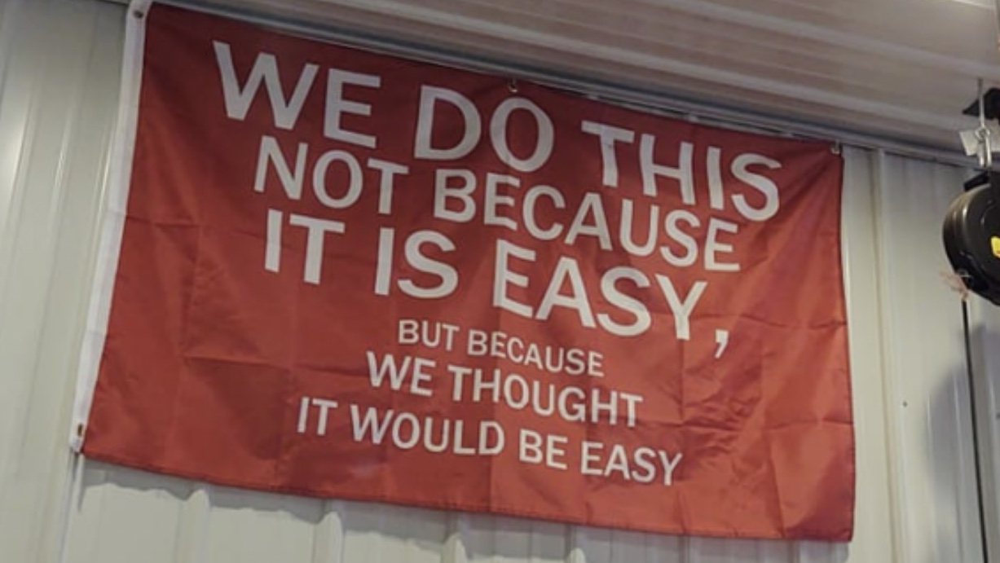

# MCPower documentation

Power analysis by simulation — any design from t-test to mixed models, in
your browser, on your desktop, or in Python and R.

Describe the study you plan to run, and MCPower generates thousands of
synthetic datasets that match it, fits your model to each, and counts how often
the effect comes out significant. That count is your power — no lookup tables,
no closed-form formulas that only cover textbook designs.

## Start here

- [[about/index|About MCPower]] — what it is, who it's for, and how it compares.
- [[concepts/index|Concepts]] — the statistical walkthrough, idea to power number.
- [[about/roadmap|Roadmap]] — what's coming next and what's being weighed.

## Use it

- [[tutorial-app/index|The app]] — desktop (Tauri) and browser (WASM), one GUI.
- [[tutorial-python/index|Python]] — the `mcpower` package.
- [[tutorial-r/index|R]] — the R package.
- [[internals/debug|Debug mode]] — pipeline introspection in R.

## More than a single power number

One run gives you the whole picture: power curves across a range of sample
sizes, automatic sample-size search, multiple-comparison corrections — and
power for many p-values at once: the chance that *all* your key tests come out
significant in the same study, which is what a multi-hypothesis paper actually
stands on. On top of that, built-in robustness scenarios stress-test the
design: flip a switch and the same analysis reruns with heterogeneous effects,
non-normal residuals, and outliers, so you see the power you'd get from messy
real-world data, not just the textbook case.

## Bring your own data (optional)

You don't need any data to start — describe the predictors and effect sizes
and MCPower generates everything. But if you have a pilot or a previous study,
upload it and the simulation inherits its real correlations and distributions
instead of idealized ones.

## No speed-for-accuracy trade-off

Monte Carlo has always been the better way to estimate power: simulate the
study as it will actually run, instead of trusting a formula whose assumptions
your design doesn't meet. The only reason to avoid it was speed. That reason
is gone.

The speed is an engineering result, not a statistical shortcut. Every model
uses the standard solver: normal equations for OLS, IRLS for GLMs, REML
optimized with BOBYQA for mixed models. Same algorithms, same convergence
tolerances, nothing approximated to run faster — see [[internals/index|what's
inside]] for how.

## Nothing leaves your machine

The online version runs entirely in your browser — the engine is compiled to
WebAssembly and executes locally, so your design and any uploaded data never
touch a server. The desktop app works fully offline. No account, no uploads.

## Checked against the tools everybody trusts

Every estimator is validated against the standard references — R, statsmodels,
and `lme4` — by fitting the same data in both and comparing the numbers. They
match. See [[validation/index|Validation]] for how this is done.

## Under the hood

- [[internals/index|What's inside]] — engine architecture and optimizations.
- [[validation/index|Validation]] — how we know the numbers are right.

## Citation & License

GPL v3. If you use MCPower in research, please cite:

Lenartowicz, P. (2025). MCPower: Monte Carlo Power Analysis for Complex Statistical Models [Computer software]. Zenodo. https://doi.org/10.5281/zenodo.16502734

```bibtex
@software{mcpower2025,
  author    = {Lenartowicz, Pawe{\l}},
  title     = {{MCPower}: Monte Carlo Power Analysis for Complex Statistical Models},
  year      = {2025},
  publisher = {Zenodo},
  doi       = {10.5281/zenodo.16502734},
  url       = {https://doi.org/10.5281/zenodo.16502734}
}
```


