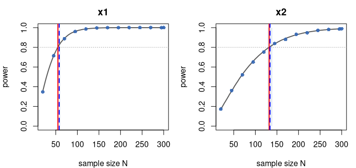
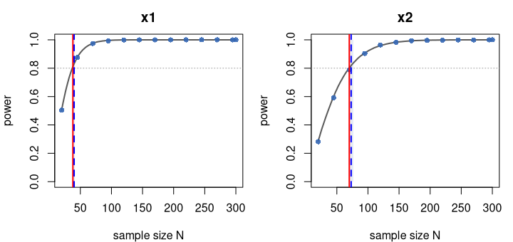
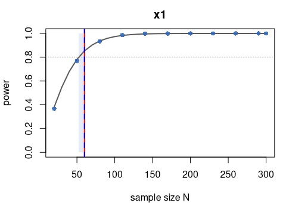
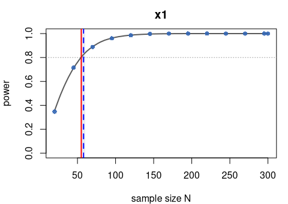

# MCPower validation — Model-based crossing estimate

# What this report shows

The model-based crossing feature fits an isotonic (PAVA) regression of
the simulated power-vs-N curve and reports the interpolated N where the
fit crosses the target — this is `n_achievable`, the headline “Required
N”. The fit also provides a Wilson-band 95% CI on that crossing, rounded
outward to integers (`ci_lo`, `ci_hi`).

This report checks that the coarse default grid (~12 auto-placed points
at 1 600 sims) agrees with a dense ground truth (step-2 grid at 100 000
sims):

- **Accuracy gate:** \|coarse n_achievable − dense n_achievable\| /
  dense ≤ `CROSSING_TOL$n_rel`.
- **Coverage gate:** `[floor(ci_lo), ceiling(ci_hi)]` brackets the dense
  crossing.

Cases: OLS two-predictor (`cross_ols`), logistic two-predictor
(`cross_glm`), LME random-intercept (`cross_lme`), and OLS with a small
second effect (`cross_partial`) where x2=0.05 is NOT expected to reach
80% within the grid.

# How the check works

1.  **Dense run** — `by = 2` over `[FROM_SIZE, TO_SIZE]` at
    `N_SIMS_DENSE` sims. The dense empirical crossing per target is
    `n_achievable` from `fitted`.
2.  **Coarse run** — auto-grid (~12 points) at `N_SIMS_COARSE` sims. The
    coarse estimate is `n_achievable` + `[ci_lo, ci_hi]` from `fitted`.
3.  Gates are computed per **fitted** target from the two runs.

# The thresholds

| Quantity | Allowed difference | Why |
|----|----|----|
| `n_rel` | ≤ `CROSSING_TOL$n_rel` = 0.1 | Relative band on \|coarse − dense\| / dense. Smoke measured worst: 0.023 (4× safety → 0.10). |
| CI coverage | boolean | \[floor(ci_lo), ceil(ci_hi)\] must contain the dense truth. |

# Case: cross_ols

cluster_atom: dense=1 coarse=1

| Target | Partial | Dense_status | Dense_N | Coarse_status | Coarse_N | Rel_diff | Acc_PASS | CI | Cov_PASS |
|:---|:---|:---|---:|:---|---:|---:|:---|:---|:---|
| x1 | FALSE | fitted | 55 | fitted | 58 | 0.0545 | TRUE | \[54, 61\] | TRUE |
| x2 | FALSE | fitted | 132 | fitted | 134 | 0.0152 | TRUE | \[127, 140\] | TRUE |

Crossing gates — cross_ols

<figure>

<figcaption aria-hidden="true">Power vs N for cross_ols: dense ground
truth, coarse grid, and the model-based crossing.</figcaption>
</figure>

*Grey curve = dense 100,000-sim ground truth; blue dots = coarse
1,600-sim default grid; dotted line = 0.8 target power. Red line = dense
crossing (truth), blue dashed = coarse model-based crossing, shaded band
= its 95% CI.*

Dense run: sample_sizes 20 - 300, 141 points, 100000 sims Coarse run:
sample_sizes 20 - 300, 13 points, 1600 sims

Golden frozen: data/cross_ols.golden.rds

# Case: cross_glm

cluster_atom: dense=1 coarse=1

| Target | Partial | Dense_status | Dense_N | Coarse_status | Coarse_N | Rel_diff | Acc_PASS | CI | Cov_PASS |
|:---|:---|:---|---:|:---|---:|---:|:---|:---|:---|
| x1 | FALSE | fitted | 38 | fitted | 40 | 0.0526 | TRUE | \[38, 42\] | TRUE |
| x2 | FALSE | fitted | 70 | fitted | 73 | 0.0429 | TRUE | \[68, 77\] | TRUE |

Crossing gates — cross_glm

<figure>

<figcaption aria-hidden="true">Power vs N for cross_glm: dense ground
truth, coarse grid, and the model-based crossing.</figcaption>
</figure>

*Grey curve = dense 100,000-sim ground truth; blue dots = coarse
1,600-sim default grid; dotted line = 0.8 target power. Red line = dense
crossing (truth), blue dashed = coarse model-based crossing, shaded band
= its 95% CI.*

Dense run: sample_sizes 20 - 300, 141 points, 100000 sims Coarse run:
sample_sizes 20 - 300, 13 points, 1600 sims

Golden frozen: data/cross_glm.golden.rds

# Case: cross_lme

cluster_atom: dense=10 coarse=10

| Target | Partial | Dense_status | Dense_N | Coarse_status | Coarse_N | Rel_diff | Acc_PASS | CI | Cov_PASS |
|:---|:---|:---|---:|:---|---:|---:|:---|:---|:---|
| x1 | FALSE | fitted | 60 | fitted | 60 | 0 | TRUE | \[52, 60\] | TRUE |

Crossing gates — cross_lme

<figure>

<figcaption aria-hidden="true">Power vs N for cross_lme: dense ground
truth, coarse grid, and the model-based crossing.</figcaption>
</figure>

*Grey curve = dense 100,000-sim ground truth; blue dots = coarse
1,600-sim default grid; dotted line = 0.8 target power. Red line = dense
crossing (truth), blue dashed = coarse model-based crossing, shaded band
= its 95% CI.*

Dense run: sample_sizes 20 - 300, 29 points, 100000 sims Coarse run:
sample_sizes 20 - 300, 11 points, 1600 sims

Golden frozen: data/cross_lme.golden.rds

# Case: cross_partial

cluster_atom: dense=1 coarse=1

| Target | Partial | Dense_status | Dense_N | Coarse_status | Coarse_N | Rel_diff | Acc_PASS | CI | Cov_PASS |
|:---|:---|:---|---:|:---|---:|---:|:---|:---|:---|
| x1 | FALSE | fitted | 55 | fitted | 58 | 0.0545 | TRUE | \[54, 61\] | TRUE |
| x2 | TRUE | not_reached | NA | not_reached | NA | NA | NA | \[NA, NA\] | NA |

Crossing gates — cross_partial

<figure>

<figcaption aria-hidden="true">Power vs N for cross_partial: dense
ground truth, coarse grid, and the model-based crossing.</figcaption>
</figure>

*Grey curve = dense 100,000-sim ground truth; blue dots = coarse
1,600-sim default grid; dotted line = 0.8 target power. Red line = dense
crossing (truth), blue dashed = coarse model-based crossing, shaded band
= its 95% CI.*

Dense run: sample_sizes 20 - 300, 141 points, 100000 sims Coarse run:
sample_sizes 20 - 300, 13 points, 1600 sims

cross_partial: partial target (x2) is not-fitted as expected
(status=not_reached).

Golden frozen: data/cross_partial.golden.rds

All gates PASS.

# Summary

| Case          | Target | Partial | Dense_N | Coarse_N | Rel_diff | Acc_PASS | Cov_PASS |
|:--------------|:-------|:--------|--------:|---------:|---------:|:---------|:---------|
| cross_ols     | x1     | FALSE   |      55 |       58 |   0.0545 | TRUE     | TRUE     |
| cross_ols     | x2     | FALSE   |     132 |      134 |   0.0152 | TRUE     | TRUE     |
| cross_glm     | x1     | FALSE   |      38 |       40 |   0.0526 | TRUE     | TRUE     |
| cross_glm     | x2     | FALSE   |      70 |       73 |   0.0429 | TRUE     | TRUE     |
| cross_lme     | x1     | FALSE   |      60 |       60 |   0.0000 | TRUE     | TRUE     |
| cross_partial | x1     | FALSE   |      55 |       58 |   0.0545 | TRUE     | TRUE     |
| cross_partial | x2     | TRUE    |      NA |       NA |       NA | NA       | NA       |

All crossing gates across all cases
