# MCPower — Validating the Data Generator

# What this report shows

MCPower answers power-analysis questions by **generating synthetic
datasets** from a formula you specify — for example *“the outcome `y`
equals `0.25 × x1` plus random noise”* — and then simulating your
analysis on those datasets many times. Everything downstream depends on
one thing being true: **the data it generates must actually embody the
formula you asked for.** If the generator is even slightly wrong, every
power number built on top of it is wrong too.

This report checks exactly that. For each supported formula we *chose*
the true coefficients, so we know the right answer in advance. The
question is simple:

> When an independent, standard statistical analysis is run on MCPower’s
> generated data, does it recover the true numbers we put in?

If it does — consistently, across every supported kind of model — the
generator is faithful.

## How the data is generated

For each formula MCPower builds a dataset of `n` rows:

- **continuous predictors** are drawn from a standard normal
  distribution (average 0, standard deviation 1);
- **categorical predictors (factors)** are assigned at the requested
  proportions (a 2-level factor becomes a single 0/1 column; a 3-level
  factor becomes two);
- **clustered (mixed-effects) data** groups the rows and gives each
  group a shared random offset, sized to hit the requested
  **intra-cluster correlation (ICC)** — specifically the *conditional*
  ICC, the correlation that remains after the predictors are accounted
  for (the raw outcome’s *marginal* ICC is lower whenever the predictors
  explain variance);
- the **outcome** is computed from the true formula and coefficients,
  then random variation is added — standard-normal noise for ordinary
  regression, a 0/1 draw at the model’s probability for logistic
  regression, a cluster offset plus noise for mixed models.

A single dataset is noisy, so we never judge from one. Instead each
formula is **regenerated many times with fresh random noise** — 1,600
times for ordinary and logistic models, 800 for mixed models — and we
look at the *distribution* of results across all of those draws.

## The three checks

**1. Data checks.** The basic statistics of the generated data should
match what was requested: predictor averages near 0, standard deviations
near 1, the requested correlations and factor proportions, the noise
variance, and the ICC. We **average each statistic over all draws**
(which cancels the random scatter of any single dataset) and require it
to land within a small fixed tolerance of the requested value.

**2. Coefficient recovery** — the headline check: *is the formula
actually true in the data?* For every generated dataset we fit a
completely **independent, standard model in R** (`lm`, `glm`, or
`lme4::lmer`) and read off the estimated coefficients. Averaged over all
draws, each estimate should land on the true value we put in. We measure
how far the average estimate is from the truth in units of its own
**standard error** (the estimate’s draw-to-draw scatter divided by the
square root of the number of draws). For OLS and mixed-effects models,
the ~103 per-coefficient z-scores are pooled across all cases and the
**false-discovery rate** is controlled via Benjamini-Hochberg at q =
0.001 (a fixed per-coefficient z-threshold below ~4 would abort nearly
every clean render on sampling noise alone). For logistic regression we
use an **absolute band** instead (\|mean − true\| ≤ 0.02), because
logistic MLE’s finite-sample bias swamps the z-score at this K — see
below.

**3. File reproduces.** The dataset saved to disk for each formula is
regenerated from its random seed, and its content fingerprint (a SHA-256
hash) is compared to the saved one. A mismatch would mean the
generator’s output had drifted, so any later comparison against the
saved file would be meaningless.

## The thresholds

| What we check | Requested value | Allowed difference |
|----|----|----|
| average of each continuous predictor | 0 | within 0.01 |
| standard deviation of each predictor | 1 | within 0.01 |
| correlation between predictors | the value you set | within 0.01 |
| factor level proportions | the values you set | within 0.01 |
| noise / within-cluster variance | 1 | within 1% |
| intra-cluster correlation (ICC), conditional | the value you set | within 0.01 |
| observed (marginal) ICC vs predicted | τ²/(τ²+σ²+Var(Xβ)) | within 0.01 |
| **coefficient recovery (OLS/LME)** | the true coefficient | pooled BH-FDR ≤ **0.001** across all cases |
| **coefficient recovery (logit)** | the true coefficient | absolute difference within **0.02** |

The data-check tolerances are tight because they apply to the *average
over all draws*, not to a single dataset — averaging thousands of draws
removes the random scatter, so anything outside these bands signals a
real generation problem.

**A note on logistic regression.** Logistic-regression estimates carry a
small, well-known *finite-sample bias*: with a limited number of rows
the maximum-likelihood estimate is slightly off even when everything is
correct. With this many draws that tiny bias becomes statistically
visible (the logistic models below show recovery distances running a bit
higher, around 3–4 standard errors), but it stays within tolerance at
the sample sizes used here. It is an expected statistical artefact, not
a flaw in the generator.

**Bias vs. spread.** For each formula we report two different things
separately. *Bias* is whether the **average** estimate is off the true
value (a centring problem). *Spread* is how much the estimates **vary**
from draw to draw. When two predictors are correlated, their estimates
naturally vary more — collinearity inflates the spread. That wider
spread is expected and correct; it is not a failure, and we say so
wherever it appears.

# Results at a glance

Every row is one formula with one set of true coefficients. “Data
checks” and “Coefficient recovery” summarise the per-formula detail that
follows.

| Formula | True coefficients | n | Data checks | Coefficient recovery | File reproduces |
|:---|:---|---:|:---|:---|:---|
| `y ~ x1` | `x1=0.25` | 400 | all OK | all OK | yes |
| `y ~ x1` | `x1=0.40` | 400 | all OK | all OK | yes |
| `y ~ x1 + x2` | `x1=0.25, x2=0.10` | 400 | all OK | all OK | yes |
| `y ~ x1 + x2` | `x1=0.40, x2=0.25` | 400 | all OK | all OK | yes |
| `y ~ x1 + x2` | `x1=0.25, x2=0.0` | 400 | all OK | all OK | yes |
| `y ~ x1 + x2` | `x1=0.25, x2=0.10` | 400 | all OK | all OK | yes |
| `y ~ x1 + x2` | `x1=0.40, x2=0.25` | 400 | all OK | all OK | yes |
| `y ~ x1*x2` | `x1=0.25, x2=0.10, x1:x2=-0.20` | 600 | all OK | all OK | yes |
| `y ~ x1*x2` | `x1=0.40, x2=0.25, x1:x2=0.15` | 600 | all OK | all OK | yes |
| `y ~ x1 + g` | `x1=0.25, g[2]=0.50, g[3]=0.80` | 600 | all OK | all OK | yes |
| `y ~ x1 + g` | `x1=0.40, g[2]=0.20, g[3]=0.50` | 600 | all OK | all OK | yes |
| `y ~ x1*g` | `x1=0.30, g[2]=0.40, g[3]=0.60, x1:g[2]=0.20, x1:g[3]=0.30` | 800 | all OK | all OK | yes |
| `y ~ x1*g` | `x1=0.40, g[2]=0.50, g[3]=0.80, x1:g[2]=0.25, x1:g[3]=0.40` | 800 | all OK | all OK | yes |
| `y ~ g1*g2` | `g1[2]=0.50, g2[2]=0.40, g1[2]:g2[2]=0.30` | 800 | all OK | all OK | yes |
| `y ~ g1*g2` | `g1[2]=0.20, g2[2]=0.80, g1[2]:g2[2]=0.50` | 800 | all OK | all OK | yes |
| `y ~ x1` | `x1=0.5` | 600 | all OK | all OK | yes |
| `y ~ x1` | `x1=0.8` | 600 | all OK | all OK | yes |
| `y ~ x1 + x2` | `x1=0.5, x2=0.3` | 800 | all OK | all OK | yes |
| `y ~ x1 + x2` | `x1=0.8, x2=0.5` | 800 | all OK | all OK | yes |
| `y ~ x1 + g` | `x1=0.5, g[2]=0.4, g[3]=0.8` | 1000 | all OK | all OK | yes |
| `y ~ x1 + g` | `x1=0.8, g[2]=0.5, g[3]=0.8` | 1000 | all OK | all OK | yes |
| `y ~ x1*x2` | `x1=0.5, x2=0.3, x1:x2=0.3` | 1000 | all OK | all OK | yes |
| `y ~ x1*x2` | `x1=0.8, x2=0.5, x1:x2=0.4` | 1000 | all OK | all OK | yes |
| `y ~ x1 + (1&#124;grp)` | `x1=0.5` | 600 | all OK | all OK | yes |
| `y ~ x1 + (1&#124;grp)` | `x1=0.3` | 600 | all OK | all OK | yes |
| `y ~ x1 + x2 + (1&#124;grp)` | `x1=0.5, x2=0.3` | 750 | all OK | all OK | yes |
| `y ~ x1 + x2 + (1&#124;grp)` | `x1=0.3, x2=0.5` | 750 | all OK | all OK | yes |
| `y ~ x1*x2 + (1&#124;grp)` | `x1=0.5, x2=0.3, x1:x2=0.3` | 750 | all OK | all OK | yes |
| `y ~ x1*x2 + (1&#124;grp)` | `x1=0.4, x2=0.3, x1:x2=0.2` | 900 | all OK | all OK | yes |
| `y ~ x1 + g + (1&#124;grp)` | `x1=0.30, g[2]=0.30` | 750 | all OK | all OK | yes |
| `y ~ x1 + g + (1&#124;grp)` | `x1=0.40, g[2]=0.50, g[3]=0.80` | 900 | all OK | all OK | yes |

> **All 31 formulas pass all three checks.** The generated data matches
> the requested statistics, an independent R model recovers every true
> coefficient, and every saved dataset reproduces from its seed.

# Formula-by-formula detail

## y = 0.25·x1 + noise

R formula `y ~ x1` · ordinary least squares (R’s `lm`) · n = 400 · saved
as `data/ols_simple_a.rds`

**How it’s built:** one continuous predictor (`x1`) drawn from a
standard normal (mean 0, sd 1). The outcome is the formula above plus
standard-normal noise. Sample size 400, random seed 2137.

**Data checks** — statistics of the generated data, averaged over all
draws, vs. what was requested:

| What we check        | Requested | Average over draws | Allowed difference | Result |
|:---------------------|----------:|-------------------:|:-------------------|:-------|
| average of x1        |         0 |             0.0003 | within 0.01        | OK     |
| std. deviation of x1 |         1 |             0.9999 | within 0.01        | OK     |
| noise variance       |         1 |             0.9987 | within 1%          | OK     |

**Coefficient recovery** — an independent R model fitted to each
generated dataset; the average estimate should land on the true value:

| Term | True value | Recovered (average) | Spread across draws | Std. errors from true | Result |
|:---|---:|---:|---:|---:|:---|
| intercept | 0.00 | 0.0009 | 0.0503 | 0.7213 | OK |
| x1 | 0.25 | 0.2490 | 0.0499 | -0.8197 | OK |

Every coefficient is centred on its true value — the formula holds in
the generated data.

<figure>
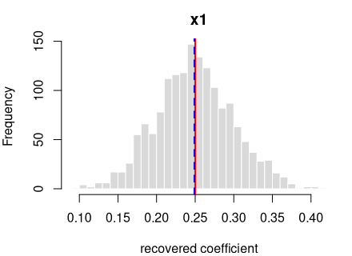
<figcaption aria-hidden="true">Recovered coefficients for y ~ x1 over
1600 datasets.</figcaption>
</figure>

*Each panel: the spread of one recovered coefficient across 1600
generated datasets. Red line = the true value, blue dashed = the average
estimate. File reproduces from seed: **yes**.*

## y = 0.4·x1 + noise

R formula `y ~ x1` · ordinary least squares (R’s `lm`) · n = 400 · saved
as `data/ols_simple_b.rds`

**How it’s built:** one continuous predictor (`x1`) drawn from a
standard normal (mean 0, sd 1). The outcome is the formula above plus
standard-normal noise. Sample size 400, random seed 2138.

**Data checks** — statistics of the generated data, averaged over all
draws, vs. what was requested:

| What we check        | Requested | Average over draws | Allowed difference | Result |
|:---------------------|----------:|-------------------:|:-------------------|:-------|
| average of x1        |         0 |             0.0003 | within 0.01        | OK     |
| std. deviation of x1 |         1 |             0.9999 | within 0.01        | OK     |
| noise variance       |         1 |             0.9986 | within 1%          | OK     |

**Coefficient recovery** — an independent R model fitted to each
generated dataset; the average estimate should land on the true value:

| Term | True value | Recovered (average) | Spread across draws | Std. errors from true | Result |
|:---|---:|---:|---:|---:|:---|
| intercept | 0.0 | 0.0009 | 0.0503 | 0.7157 | OK |
| x1 | 0.4 | 0.3989 | 0.0499 | -0.8420 | OK |

Every coefficient is centred on its true value — the formula holds in
the generated data.

<figure>

<figcaption aria-hidden="true">Recovered coefficients for y ~ x1 over
1600 datasets.</figcaption>
</figure>

*Each panel: the spread of one recovered coefficient across 1600
generated datasets. Red line = the true value, blue dashed = the average
estimate. File reproduces from seed: **yes**.*

## y = 0.25·x1 + 0.1·x2 + noise

R formula `y ~ x1 + x2` · ordinary least squares (R’s `lm`) · n = 400 ·
saved as `data/ols_two_a.rds`

**How it’s built:** 2 continuous predictors (`x1`, `x2`) drawn from a
standard normal (mean 0, sd 1). The outcome is the formula above plus
standard-normal noise. Sample size 400, random seed 2137.

**Data checks** — statistics of the generated data, averaged over all
draws, vs. what was requested:

| What we check        | Requested | Average over draws | Allowed difference | Result |
|:---------------------|----------:|-------------------:|:-------------------|:-------|
| average of x1        |         0 |             0.0003 | within 0.01        | OK     |
| std. deviation of x1 |         1 |             0.9999 | within 0.01        | OK     |
| average of x2        |         0 |             0.0016 | within 0.01        | OK     |
| std. deviation of x2 |         1 |             0.9987 | within 0.01        | OK     |
| noise variance       |         1 |             0.9986 | within 1%          | OK     |

**Coefficient recovery** — an independent R model fitted to each
generated dataset; the average estimate should land on the true value:

| Term | True value | Recovered (average) | Spread across draws | Std. errors from true | Result |
|:---|---:|---:|---:|---:|:---|
| intercept | 0.00 | 0.0009 | 0.0504 | 0.7429 | OK |
| x1 | 0.25 | 0.2490 | 0.0500 | -0.8043 | OK |
| x2 | 0.10 | 0.1018 | 0.0512 | 1.4445 | OK |

Every coefficient is centred on its true value — the formula holds in
the generated data.

<figure>
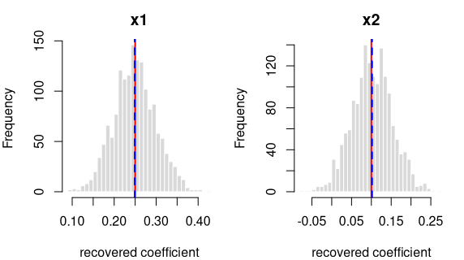
<figcaption aria-hidden="true">Recovered coefficients for y ~ x1 + x2
over 1600 datasets.</figcaption>
</figure>

*Each panel: the spread of one recovered coefficient across 1600
generated datasets. Red line = the true value, blue dashed = the average
estimate. File reproduces from seed: **yes**.*

## y = 0.4·x1 + 0.25·x2 + noise

R formula `y ~ x1 + x2` · ordinary least squares (R’s `lm`) · n = 400 ·
saved as `data/ols_two_b.rds`

**How it’s built:** 2 continuous predictors (`x1`, `x2`) drawn from a
standard normal (mean 0, sd 1). The outcome is the formula above plus
standard-normal noise. Sample size 400, random seed 2138.

**Data checks** — statistics of the generated data, averaged over all
draws, vs. what was requested:

| What we check        | Requested | Average over draws | Allowed difference | Result |
|:---------------------|----------:|-------------------:|:-------------------|:-------|
| average of x1        |         0 |             0.0003 | within 0.01        | OK     |
| std. deviation of x1 |         1 |             0.9999 | within 0.01        | OK     |
| average of x2        |         0 |             0.0016 | within 0.01        | OK     |
| std. deviation of x2 |         1 |             0.9987 | within 0.01        | OK     |
| noise variance       |         1 |             0.9985 | within 1%          | OK     |

**Coefficient recovery** — an independent R model fitted to each
generated dataset; the average estimate should land on the true value:

| Term | True value | Recovered (average) | Spread across draws | Std. errors from true | Result |
|:---|---:|---:|---:|---:|:---|
| intercept | 0.00 | 0.0009 | 0.0504 | 0.7352 | OK |
| x1 | 0.40 | 0.3990 | 0.0499 | -0.8285 | OK |
| x2 | 0.25 | 0.2519 | 0.0512 | 1.4579 | OK |

Every coefficient is centred on its true value — the formula holds in
the generated data.

<figure>
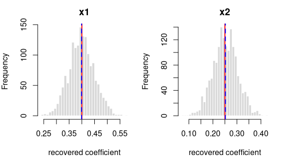
<figcaption aria-hidden="true">Recovered coefficients for y ~ x1 + x2
over 1600 datasets.</figcaption>
</figure>

*Each panel: the spread of one recovered coefficient across 1600
generated datasets. Red line = the true value, blue dashed = the average
estimate. File reproduces from seed: **yes**.*

## y = 0.25·x1 + 0·x2 + noise

R formula `y ~ x1 + x2` · ordinary least squares (R’s `lm`) · n = 400 ·
saved as `data/ols_zero_a.rds`

**How it’s built:** 2 continuous predictors (`x1`, `x2`) drawn from a
standard normal (mean 0, sd 1). The outcome is the formula above plus
standard-normal noise. Sample size 400, random seed 2137.

**Data checks** — statistics of the generated data, averaged over all
draws, vs. what was requested:

| What we check        | Requested | Average over draws | Allowed difference | Result |
|:---------------------|----------:|-------------------:|:-------------------|:-------|
| average of x1        |         0 |             0.0003 | within 0.01        | OK     |
| std. deviation of x1 |         1 |             0.9999 | within 0.01        | OK     |
| average of x2        |         0 |             0.0016 | within 0.01        | OK     |
| std. deviation of x2 |         1 |             0.9987 | within 0.01        | OK     |
| noise variance       |         1 |             0.9986 | within 1%          | OK     |

**Coefficient recovery** — an independent R model fitted to each
generated dataset; the average estimate should land on the true value:

| Term | True value | Recovered (average) | Spread across draws | Std. errors from true | Result |
|:---|---:|---:|---:|---:|:---|
| intercept | 0.00 | 0.0009 | 0.0504 | 0.7429 | OK |
| x1 | 0.25 | 0.2490 | 0.0500 | -0.8043 | OK |
| x2 | 0.00 | 0.0018 | 0.0512 | 1.4445 | OK |

Every coefficient is centred on its true value — the formula holds in
the generated data.

<figure>
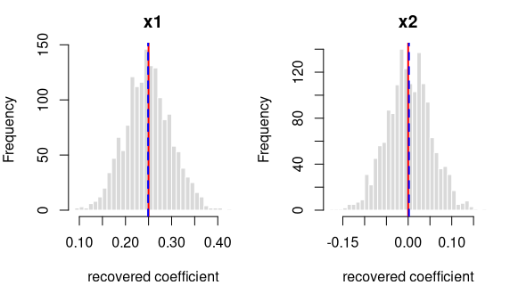
<figcaption aria-hidden="true">Recovered coefficients for y ~ x1 + x2
over 1600 datasets.</figcaption>
</figure>

*Each panel: the spread of one recovered coefficient across 1600
generated datasets. Red line = the true value, blue dashed = the average
estimate. File reproduces from seed: **yes**.*

## y = 0.25·x1 + 0.1·x2 + noise

R formula `y ~ x1 + x2` · ordinary least squares (R’s `lm`) · n = 400 ·
saved as `data/ols_corr_a.rds`

**How it’s built:** 2 continuous predictors (`x1`, `x2`) drawn from a
standard normal (mean 0, sd 1); `x1` and `x2` correlated at 0.50. The
outcome is the formula above plus standard-normal noise. Sample size
400, random seed 2137.

**Data checks** — statistics of the generated data, averaged over all
draws, vs. what was requested:

| What we check | Requested | Average over draws | Allowed difference | Result |
|:---|---:|---:|:---|:---|
| average of x1 | 0.0 | 0.0003 | within 0.01 | OK |
| std. deviation of x1 | 1.0 | 0.9999 | within 0.01 | OK |
| average of x2 | 0.0 | 0.0015 | within 0.01 | OK |
| std. deviation of x2 | 1.0 | 0.9988 | within 0.01 | OK |
| correlation of x1 and x2 | 0.5 | 0.4997 | within 0.01 | OK |
| noise variance | 1.0 | 0.9986 | within 1% | OK |

**Coefficient recovery** — an independent R model fitted to each
generated dataset; the average estimate should land on the true value:

| Term | True value | Recovered (average) | Spread across draws | Std. errors from true | Result |
|:---|---:|---:|---:|---:|:---|
| intercept | 0.00 | 0.0009 | 0.0504 | 0.7429 | OK |
| x1 | 0.25 | 0.2479 | 0.0575 | -1.4427 | OK |
| x2 | 0.10 | 0.1021 | 0.0591 | 1.4445 | OK |

Every coefficient is centred on its true value — the formula holds in
the generated data. Because `x1` and `x2` are correlated (0.50), their
estimates vary more from draw to draw; that wider spread is the expected
effect of collinearity, not a problem.

<figure>
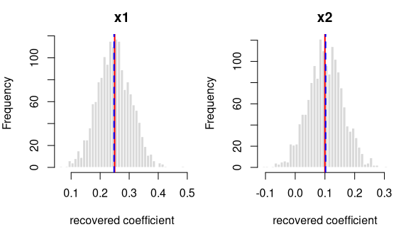
<figcaption aria-hidden="true">Recovered coefficients for y ~ x1 + x2
over 1600 datasets.</figcaption>
</figure>

*Each panel: the spread of one recovered coefficient across 1600
generated datasets. Red line = the true value, blue dashed = the average
estimate. File reproduces from seed: **yes**.*

## y = 0.4·x1 + 0.25·x2 + noise

R formula `y ~ x1 + x2` · ordinary least squares (R’s `lm`) · n = 400 ·
saved as `data/ols_corr_b.rds`

**How it’s built:** 2 continuous predictors (`x1`, `x2`) drawn from a
standard normal (mean 0, sd 1); `x1` and `x2` correlated at 0.30. The
outcome is the formula above plus standard-normal noise. Sample size
400, random seed 2138.

**Data checks** — statistics of the generated data, averaged over all
draws, vs. what was requested:

| What we check | Requested | Average over draws | Allowed difference | Result |
|:---|---:|---:|:---|:---|
| average of x1 | 0.0 | 0.0003 | within 0.01 | OK |
| std. deviation of x1 | 1.0 | 0.9999 | within 0.01 | OK |
| average of x2 | 0.0 | 0.0016 | within 0.01 | OK |
| std. deviation of x2 | 1.0 | 0.9987 | within 0.01 | OK |
| correlation of x1 and x2 | 0.3 | 0.2997 | within 0.01 | OK |
| noise variance | 1.0 | 0.9985 | within 1% | OK |

**Coefficient recovery** — an independent R model fitted to each
generated dataset; the average estimate should land on the true value:

| Term | True value | Recovered (average) | Spread across draws | Std. errors from true | Result |
|:---|---:|---:|---:|---:|:---|
| intercept | 0.00 | 0.0009 | 0.0504 | 0.7352 | OK |
| x1 | 0.40 | 0.3984 | 0.0521 | -1.2446 | OK |
| x2 | 0.25 | 0.2520 | 0.0537 | 1.4579 | OK |

Every coefficient is centred on its true value — the formula holds in
the generated data. Because `x1` and `x2` are correlated (0.30), their
estimates vary more from draw to draw; that wider spread is the expected
effect of collinearity, not a problem.

<figure>
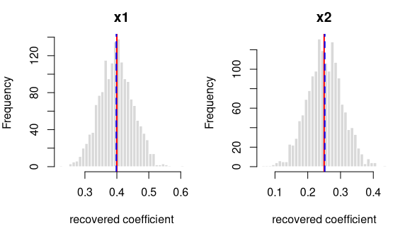
<figcaption aria-hidden="true">Recovered coefficients for y ~ x1 + x2
over 1600 datasets.</figcaption>
</figure>

*Each panel: the spread of one recovered coefficient across 1600
generated datasets. Red line = the true value, blue dashed = the average
estimate. File reproduces from seed: **yes**.*

## y = 0.25·x1 + 0.1·x2 − 0.2·x1:x2 + noise

R formula `y ~ x1*x2` · ordinary least squares (R’s `lm`) · n = 600 ·
saved as `data/ols_interaction_a.rds`

**How it’s built:** 2 continuous predictors (`x1`, `x2`) drawn from a
standard normal (mean 0, sd 1); `x1` and `x2` correlated at 0.30. The
outcome is the formula above plus standard-normal noise. Sample size
600, random seed 2137.

**Data checks** — statistics of the generated data, averaged over all
draws, vs. what was requested:

| What we check | Requested | Average over draws | Allowed difference | Result |
|:---|---:|---:|:---|:---|
| average of x1 | 0.0 | 0.0002 | within 0.01 | OK |
| std. deviation of x1 | 1.0 | 0.9998 | within 0.01 | OK |
| average of x2 | 0.0 | 0.0012 | within 0.01 | OK |
| std. deviation of x2 | 1.0 | 0.9994 | within 0.01 | OK |
| correlation of x1 and x2 | 0.3 | 0.3000 | within 0.01 | OK |
| noise variance | 1.0 | 1.0006 | within 1% | OK |

**Coefficient recovery** — an independent R model fitted to each
generated dataset; the average estimate should land on the true value:

| Term | True value | Recovered (average) | Spread across draws | Std. errors from true | Result |
|:---|---:|---:|---:|---:|:---|
| intercept | 0.00 | 0.0024 | 0.0420 | 2.3300 | OK |
| x1 | 0.25 | 0.2479 | 0.0421 | -1.9544 | OK |
| x2 | 0.10 | 0.1018 | 0.0437 | 1.6031 | OK |
| x1:x2 | -0.20 | -0.2002 | 0.0386 | -0.1597 | OK |

Every coefficient is centred on its true value — the formula holds in
the generated data. Because `x1` and `x2` are correlated (0.30), their
estimates vary more from draw to draw; that wider spread is the expected
effect of collinearity, not a problem.

<figure>
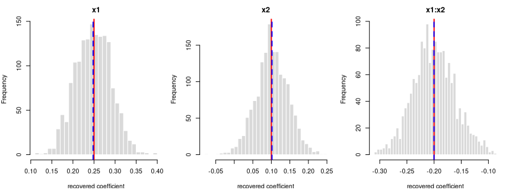
<figcaption aria-hidden="true">Recovered coefficients for y ~ x1*x2 over
1600 datasets.</figcaption>
</figure>

*Each panel: the spread of one recovered coefficient across 1600
generated datasets. Red line = the true value, blue dashed = the average
estimate. File reproduces from seed: **yes**.*

## y = 0.4·x1 + 0.25·x2 + 0.15·x1:x2 + noise

R formula `y ~ x1*x2` · ordinary least squares (R’s `lm`) · n = 600 ·
saved as `data/ols_interaction_b.rds`

**How it’s built:** 2 continuous predictors (`x1`, `x2`) drawn from a
standard normal (mean 0, sd 1). The outcome is the formula above plus
standard-normal noise. Sample size 600, random seed 2138.

**Data checks** — statistics of the generated data, averaged over all
draws, vs. what was requested:

| What we check        | Requested | Average over draws | Allowed difference | Result |
|:---------------------|----------:|-------------------:|:-------------------|:-------|
| average of x1        |         0 |             0.0002 | within 0.01        | OK     |
| std. deviation of x1 |         1 |             0.9998 | within 0.01        | OK     |
| average of x2        |         0 |             0.0012 | within 0.01        | OK     |
| std. deviation of x2 |         1 |             0.9993 | within 0.01        | OK     |
| noise variance       |         1 |             1.0006 | within 1%          | OK     |

**Coefficient recovery** — an independent R model fitted to each
generated dataset; the average estimate should land on the true value:

| Term | True value | Recovered (average) | Spread across draws | Std. errors from true | Result |
|:---|---:|---:|---:|---:|:---|
| intercept | 0.00 | 0.0024 | 0.0404 | 2.3519 | OK |
| x1 | 0.40 | 0.3984 | 0.0404 | -1.5424 | OK |
| x2 | 0.25 | 0.2517 | 0.0418 | 1.5936 | OK |
| x1:x2 | 0.15 | 0.1500 | 0.0400 | -0.0045 | OK |

Every coefficient is centred on its true value — the formula holds in
the generated data.

<figure>
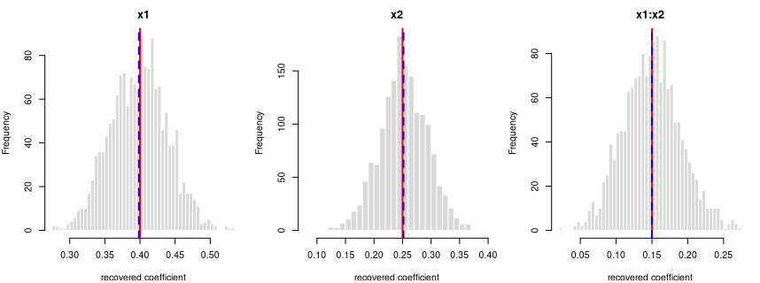
<figcaption aria-hidden="true">Recovered coefficients for y ~ x1*x2 over
1600 datasets.</figcaption>
</figure>

*Each panel: the spread of one recovered coefficient across 1600
generated datasets. Red line = the true value, blue dashed = the average
estimate. File reproduces from seed: **yes**.*

## y = 0.25·x1 + 0.5·g\[2\] + 0.8·g\[3\] + noise

R formula `y ~ x1 + g` · ordinary least squares (R’s `lm`) · n = 600 ·
saved as `data/ols_factor_a.rds`

**How it’s built:** one continuous predictor (`x1`) drawn from a
standard normal (mean 0, sd 1); a 3-level factor `g` at proportions
50%/30%/20%. The outcome is the formula above plus standard-normal
noise. Sample size 600, random seed 2137.

**Data checks** — statistics of the generated data, averaged over all
draws, vs. what was requested:

| What we check         | Requested | Average over draws | Allowed difference | Result |
|:----------------------|----------:|-------------------:|:-------------------|:-------|
| average of x1         |       0.0 |             0.0002 | within 0.01        | OK     |
| std. deviation of x1  |       1.0 |             0.9998 | within 0.01        | OK     |
| proportion in level 0 |       0.5 |             0.5000 | within 0.01        | OK     |
| proportion in level 1 |       0.3 |             0.3000 | within 0.01        | OK     |
| proportion in level 2 |       0.2 |             0.2000 | within 0.01        | OK     |
| noise variance        |       1.0 |             1.0006 | within 1%          | OK     |

**Coefficient recovery** — an independent R model fitted to each
generated dataset; the average estimate should land on the true value:

| Term | True value | Recovered (average) | Spread across draws | Std. errors from true | Result |
|:---|---:|---:|---:|---:|:---|
| intercept | 0.00 | 0.0019 | 0.0575 | 1.3304 | OK |
| x1 | 0.25 | 0.2484 | 0.0404 | -1.5703 | OK |
| g\[2\] | 0.50 | 0.5006 | 0.0940 | 0.2410 | OK |
| g\[3\] | 0.80 | 0.8017 | 0.1081 | 0.6291 | OK |

Every coefficient is centred on its true value — the formula holds in
the generated data.

<figure>
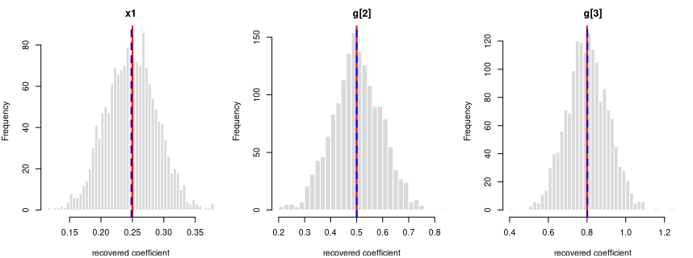
<figcaption aria-hidden="true">Recovered coefficients for y ~ x1 + g
over 1600 datasets.</figcaption>
</figure>

*Each panel: the spread of one recovered coefficient across 1600
generated datasets. Red line = the true value, blue dashed = the average
estimate. File reproduces from seed: **yes**.*

## y = 0.4·x1 + 0.2·g\[2\] + 0.5·g\[3\] + noise

R formula `y ~ x1 + g` · ordinary least squares (R’s `lm`) · n = 600 ·
saved as `data/ols_factor_b.rds`

**How it’s built:** one continuous predictor (`x1`) drawn from a
standard normal (mean 0, sd 1); a 3-level factor `g` at proportions
40%/35%/25%. The outcome is the formula above plus standard-normal
noise. Sample size 600, random seed 2138.

**Data checks** — statistics of the generated data, averaged over all
draws, vs. what was requested:

| What we check         | Requested | Average over draws | Allowed difference | Result |
|:----------------------|----------:|-------------------:|:-------------------|:-------|
| average of x1         |      0.00 |             0.0002 | within 0.01        | OK     |
| std. deviation of x1  |      1.00 |             0.9998 | within 0.01        | OK     |
| proportion in level 0 |      0.40 |             0.4000 | within 0.01        | OK     |
| proportion in level 1 |      0.35 |             0.3500 | within 0.01        | OK     |
| proportion in level 2 |      0.25 |             0.2500 | within 0.01        | OK     |
| noise variance        |      1.00 |             1.0006 | within 1%          | OK     |

**Coefficient recovery** — an independent R model fitted to each
generated dataset; the average estimate should land on the true value:

| Term | True value | Recovered (average) | Spread across draws | Std. errors from true | Result |
|:---|---:|---:|---:|---:|:---|
| intercept | 0.0 | 0.0014 | 0.0640 | 0.8709 | OK |
| x1 | 0.4 | 0.3984 | 0.0405 | -1.6196 | OK |
| g\[2\] | 0.2 | 0.2030 | 0.0938 | 1.2617 | OK |
| g\[3\] | 0.5 | 0.4999 | 0.1034 | -0.0267 | OK |

Every coefficient is centred on its true value — the formula holds in
the generated data.

<figure>
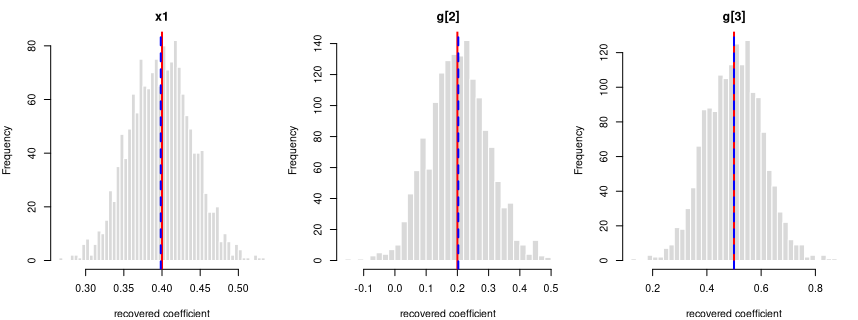
<figcaption aria-hidden="true">Recovered coefficients for y ~ x1 + g
over 1600 datasets.</figcaption>
</figure>

*Each panel: the spread of one recovered coefficient across 1600
generated datasets. Red line = the true value, blue dashed = the average
estimate. File reproduces from seed: **yes**.*

## y = 0.3·x1 + 0.4·g\[2\] + 0.6·g\[3\] + 0.2·x1:g\[2\] + 0.3·x1:g\[3\] + noise

R formula `y ~ x1*g` · ordinary least squares (R’s `lm`) · n = 800 ·
saved as `data/ols_cf_a.rds`

**How it’s built:** one continuous predictor (`x1`) drawn from a
standard normal (mean 0, sd 1); a 3-level factor `g` at proportions
50%/30%/20%. The outcome is the formula above plus standard-normal
noise. Sample size 800, random seed 2137.

**Data checks** — statistics of the generated data, averaged over all
draws, vs. what was requested:

| What we check         | Requested | Average over draws | Allowed difference | Result |
|:----------------------|----------:|-------------------:|:-------------------|:-------|
| average of x1         |       0.0 |             0.0014 | within 0.01        | OK     |
| std. deviation of x1  |       1.0 |             1.0000 | within 0.01        | OK     |
| proportion in level 0 |       0.5 |             0.5000 | within 0.01        | OK     |
| proportion in level 1 |       0.3 |             0.3000 | within 0.01        | OK     |
| proportion in level 2 |       0.2 |             0.2000 | within 0.01        | OK     |
| noise variance        |       1.0 |             1.0007 | within 1%          | OK     |

**Coefficient recovery** — an independent R model fitted to each
generated dataset; the average estimate should land on the true value:

| Term | True value | Recovered (average) | Spread across draws | Std. errors from true | Result |
|:---|---:|---:|---:|---:|:---|
| intercept | 0.0 | 0.0008 | 0.0506 | 0.6615 | OK |
| x1 | 0.3 | 0.2974 | 0.0502 | -2.0526 | OK |
| g\[2\] | 0.4 | 0.4013 | 0.0826 | 0.6342 | OK |
| g\[3\] | 0.6 | 0.6013 | 0.0946 | 0.5694 | OK |
| x1:g\[2\] | 0.2 | 0.2014 | 0.0812 | 0.6654 | OK |
| x1:g\[3\] | 0.3 | 0.3056 | 0.0972 | 2.3123 | OK |

Every coefficient is centred on its true value — the formula holds in
the generated data.

<figure>
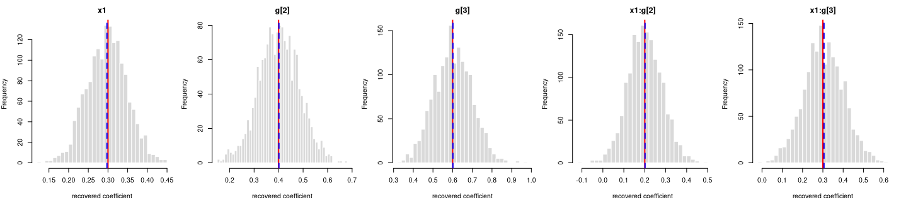
<figcaption aria-hidden="true">Recovered coefficients for y ~ x1*g over
1600 datasets.</figcaption>
</figure>

*Each panel: the spread of one recovered coefficient across 1600
generated datasets. Red line = the true value, blue dashed = the average
estimate. File reproduces from seed: **yes**.*

## y = 0.4·x1 + 0.5·g\[2\] + 0.8·g\[3\] + 0.25·x1:g\[2\] + 0.4·x1:g\[3\] + noise

R formula `y ~ x1*g` · ordinary least squares (R’s `lm`) · n = 800 ·
saved as `data/ols_cf_b.rds`

**How it’s built:** one continuous predictor (`x1`) drawn from a
standard normal (mean 0, sd 1); a 3-level factor `g` at proportions
40%/35%/25%. The outcome is the formula above plus standard-normal
noise. Sample size 800, random seed 2138.

**Data checks** — statistics of the generated data, averaged over all
draws, vs. what was requested:

| What we check         | Requested | Average over draws | Allowed difference | Result |
|:----------------------|----------:|-------------------:|:-------------------|:-------|
| average of x1         |      0.00 |             0.0014 | within 0.01        | OK     |
| std. deviation of x1  |      1.00 |             1.0000 | within 0.01        | OK     |
| proportion in level 0 |      0.40 |             0.4000 | within 0.01        | OK     |
| proportion in level 1 |      0.35 |             0.3500 | within 0.01        | OK     |
| proportion in level 2 |      0.25 |             0.2500 | within 0.01        | OK     |
| noise variance        |      1.00 |             1.0006 | within 1%          | OK     |

**Coefficient recovery** — an independent R model fitted to each
generated dataset; the average estimate should land on the true value:

| Term | True value | Recovered (average) | Spread across draws | Std. errors from true | Result |
|:---|---:|---:|---:|---:|:---|
| intercept | 0.00 | 0.0013 | 0.0554 | 0.9654 | OK |
| x1 | 0.40 | 0.3963 | 0.0577 | -2.5524 | OK |
| g\[2\] | 0.50 | 0.5015 | 0.0826 | 0.7481 | OK |
| g\[3\] | 0.80 | 0.7988 | 0.0904 | -0.5218 | OK |
| x1:g\[2\] | 0.25 | 0.2528 | 0.0839 | 1.3386 | OK |
| x1:g\[3\] | 0.40 | 0.4061 | 0.0916 | 2.6768 | OK |

Every coefficient is centred on its true value — the formula holds in
the generated data.

<figure>
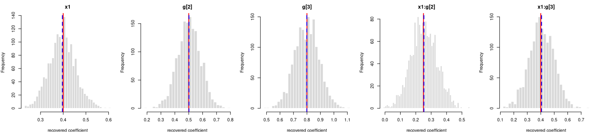
<figcaption aria-hidden="true">Recovered coefficients for y ~ x1*g over
1600 datasets.</figcaption>
</figure>

*Each panel: the spread of one recovered coefficient across 1600
generated datasets. Red line = the true value, blue dashed = the average
estimate. File reproduces from seed: **yes**.*

## y = 0.5·g1\[2\] + 0.4·g2\[2\] + 0.3·g1\[2\]:g2\[2\] + noise

R formula `y ~ g1*g2` · ordinary least squares (R’s `lm`) · n = 800 ·
saved as `data/ols_ff_a.rds`

**How it’s built:** a 2-level factor `g1` at proportions 50%/50%; a
2-level factor `g2` at proportions 60%/40%. The outcome is the formula
above plus standard-normal noise. Sample size 800, random seed 2137.

**Data checks** — statistics of the generated data, averaged over all
draws, vs. what was requested:

| What we check  | Requested | Average over draws | Allowed difference | Result |
|:---------------|----------:|-------------------:|:-------------------|:-------|
| noise variance |         1 |             1.0007 | within 1%          | OK     |

**Coefficient recovery** — an independent R model fitted to each
generated dataset; the average estimate should land on the true value:

| Term | True value | Recovered (average) | Spread across draws | Std. errors from true | Result |
|:---|---:|---:|---:|---:|:---|
| intercept | 0.0 | 0.0000 | 0.0619 | 0.0222 | OK |
| g1\[2\] | 0.5 | 0.5025 | 0.0888 | 1.1111 | OK |
| g2\[2\] | 0.4 | 0.3992 | 0.0992 | -0.3184 | OK |
| g1\[2\]:g2\[2\] | 0.3 | 0.3030 | 0.1451 | 0.8201 | OK |

Every coefficient is centred on its true value — the formula holds in
the generated data.

<figure>
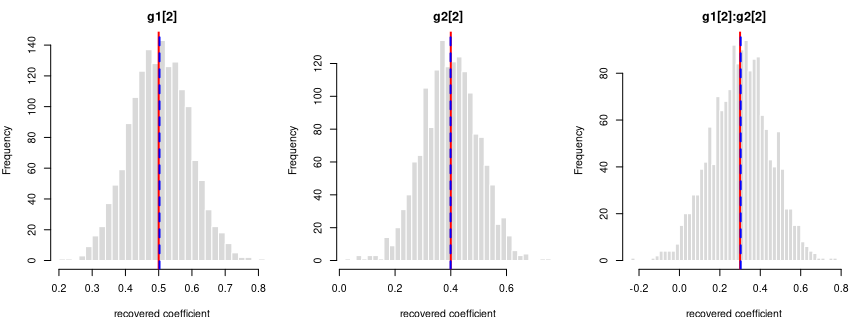
<figcaption aria-hidden="true">Recovered coefficients for y ~ g1*g2 over
1600 datasets.</figcaption>
</figure>

*Each panel: the spread of one recovered coefficient across 1600
generated datasets. Red line = the true value, blue dashed = the average
estimate. File reproduces from seed: **yes**.*

## y = 0.2·g1\[2\] + 0.8·g2\[2\] + 0.5·g1\[2\]:g2\[2\] + noise

R formula `y ~ g1*g2` · ordinary least squares (R’s `lm`) · n = 800 ·
saved as `data/ols_ff_b.rds`

**How it’s built:** a 2-level factor `g1` at proportions 50%/50%; a
2-level factor `g2` at proportions 55%/45%. The outcome is the formula
above plus standard-normal noise. Sample size 800, random seed 2138.

**Data checks** — statistics of the generated data, averaged over all
draws, vs. what was requested:

| What we check  | Requested | Average over draws | Allowed difference | Result |
|:---------------|----------:|-------------------:|:-------------------|:-------|
| noise variance |         1 |             1.0007 | within 1%          | OK     |

**Coefficient recovery** — an independent R model fitted to each
generated dataset; the average estimate should land on the true value:

| Term | True value | Recovered (average) | Spread across draws | Std. errors from true | Result |
|:---|---:|---:|---:|---:|:---|
| intercept | 0.0 | -0.0005 | 0.0701 | -0.2752 | OK |
| g1\[2\] | 0.2 | 0.2026 | 0.0968 | 1.0546 | OK |
| g2\[2\] | 0.8 | 0.8004 | 0.0988 | 0.1608 | OK |
| g1\[2\]:g2\[2\] | 0.5 | 0.5028 | 0.1490 | 0.7572 | OK |

Every coefficient is centred on its true value — the formula holds in
the generated data.

<figure>
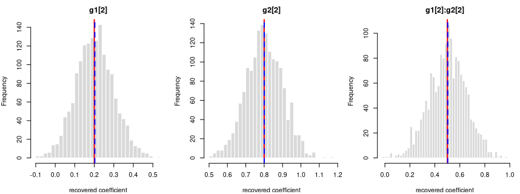
<figcaption aria-hidden="true">Recovered coefficients for y ~ g1*g2 over
1600 datasets.</figcaption>
</figure>

*Each panel: the spread of one recovered coefficient across 1600
generated datasets. Red line = the true value, blue dashed = the average
estimate. File reproduces from seed: **yes**.*

## log-odds(y = 1) = logit(0.30) + 0.5·x1

R formula `y ~ x1` · logistic regression (R’s `glm`) · n = 600 · saved
as `data/glm_simple_a.rds`

**How it’s built:** one continuous predictor (`x1`) drawn from a
standard normal (mean 0, sd 1). The outcome is 1 or 0, drawn at the
logistic probability of the formula above (baseline rate 30%). Sample
size 600, random seed 2137.

**Data checks** — statistics of the generated data, averaged over all
draws, vs. what was requested:

| What we check        | Requested | Average over draws | Allowed difference | Result |
|:---------------------|----------:|-------------------:|:-------------------|:-------|
| average of x1        |         0 |             0.0002 | within 0.01        | OK     |
| std. deviation of x1 |         1 |             0.9998 | within 0.01        | OK     |

**Coefficient recovery** — an independent R model fitted to each
generated dataset; the average estimate should land on the true value:

| Term | True value | Recovered (average) | Spread across draws | Std. errors from true | Result |
|:---|---:|---:|---:|---:|:---|
| intercept | -0.8473 | -0.8543 | 0.0931 | -2.9921 | OK |
| x1 | 0.5000 | 0.5063 | 0.0951 | 2.6404 | OK |

Every coefficient is centred on its true value — the formula holds in
the generated data.

<figure>
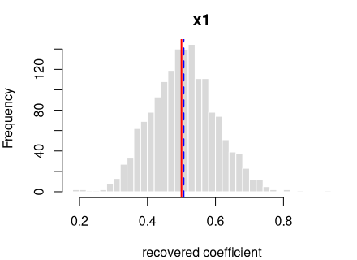
<figcaption aria-hidden="true">Recovered coefficients for y ~ x1 over
1600 datasets.</figcaption>
</figure>

*Each panel: the spread of one recovered coefficient across 1600
generated datasets. Red line = the true value, blue dashed = the average
estimate. File reproduces from seed: **yes**.*

## log-odds(y = 1) = logit(0.50) + 0.8·x1

R formula `y ~ x1` · logistic regression (R’s `glm`) · n = 600 · saved
as `data/glm_simple_b.rds`

**How it’s built:** one continuous predictor (`x1`) drawn from a
standard normal (mean 0, sd 1). The outcome is 1 or 0, drawn at the
logistic probability of the formula above (baseline rate 50%). Sample
size 600, random seed 2138.

**Data checks** — statistics of the generated data, averaged over all
draws, vs. what was requested:

| What we check        | Requested | Average over draws | Allowed difference | Result |
|:---------------------|----------:|-------------------:|:-------------------|:-------|
| average of x1        |         0 |             0.0002 | within 0.01        | OK     |
| std. deviation of x1 |         1 |             0.9998 | within 0.01        | OK     |

**Coefficient recovery** — an independent R model fitted to each
generated dataset; the average estimate should land on the true value:

| Term | True value | Recovered (average) | Spread across draws | Std. errors from true | Result |
|:---|---:|---:|---:|---:|:---|
| intercept | 0.0 | -0.0038 | 0.0858 | -1.7599 | OK |
| x1 | 0.8 | 0.8109 | 0.1025 | 4.2568 | OK |

Every coefficient is centred on its true value — the formula holds in
the generated data.

<figure>
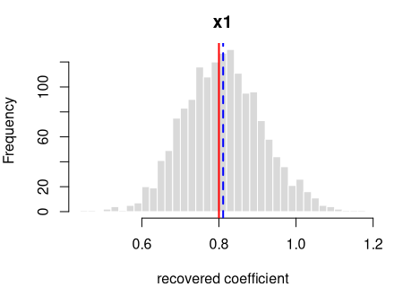
<figcaption aria-hidden="true">Recovered coefficients for y ~ x1 over
1600 datasets.</figcaption>
</figure>

*Each panel: the spread of one recovered coefficient across 1600
generated datasets. Red line = the true value, blue dashed = the average
estimate. File reproduces from seed: **yes**.*

## log-odds(y = 1) = logit(0.30) + 0.5·x1 + 0.3·x2

R formula `y ~ x1 + x2` · logistic regression (R’s `glm`) · n = 800 ·
saved as `data/glm_two_a.rds`

**How it’s built:** 2 continuous predictors (`x1`, `x2`) drawn from a
standard normal (mean 0, sd 1); `x1` and `x2` correlated at 0.20. The
outcome is 1 or 0, drawn at the logistic probability of the formula
above (baseline rate 30%). Sample size 800, random seed 2137.

**Data checks** — statistics of the generated data, averaged over all
draws, vs. what was requested:

| What we check | Requested | Average over draws | Allowed difference | Result |
|:---|---:|---:|:---|:---|
| average of x1 | 0.0 | 0.0014 | within 0.01 | OK |
| std. deviation of x1 | 1.0 | 1.0000 | within 0.01 | OK |
| average of x2 | 0.0 | 0.0010 | within 0.01 | OK |
| std. deviation of x2 | 1.0 | 0.9995 | within 0.01 | OK |
| correlation of x1 and x2 | 0.2 | 0.2001 | within 0.01 | OK |

**Coefficient recovery** — an independent R model fitted to each
generated dataset; the average estimate should land on the true value:

| Term | True value | Recovered (average) | Spread across draws | Std. errors from true | Result |
|:---|---:|---:|---:|---:|:---|
| intercept | -0.8473 | -0.8528 | 0.0810 | -2.7143 | OK |
| x1 | 0.5000 | 0.5037 | 0.0852 | 1.7568 | OK |
| x2 | 0.3000 | 0.3028 | 0.0813 | 1.3693 | OK |

Every coefficient is centred on its true value — the formula holds in
the generated data. Because `x1` and `x2` are correlated (0.20), their
estimates vary more from draw to draw; that wider spread is the expected
effect of collinearity, not a problem.

<figure>
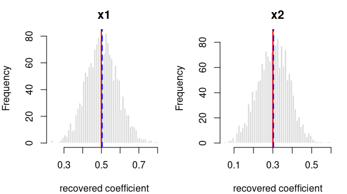
<figcaption aria-hidden="true">Recovered coefficients for y ~ x1 + x2
over 1600 datasets.</figcaption>
</figure>

*Each panel: the spread of one recovered coefficient across 1600
generated datasets. Red line = the true value, blue dashed = the average
estimate. File reproduces from seed: **yes**.*

## log-odds(y = 1) = logit(0.50) + 0.8·x1 + 0.5·x2

R formula `y ~ x1 + x2` · logistic regression (R’s `glm`) · n = 800 ·
saved as `data/glm_two_b.rds`

**How it’s built:** 2 continuous predictors (`x1`, `x2`) drawn from a
standard normal (mean 0, sd 1). The outcome is 1 or 0, drawn at the
logistic probability of the formula above (baseline rate 50%). Sample
size 800, random seed 2138.

**Data checks** — statistics of the generated data, averaged over all
draws, vs. what was requested:

| What we check        | Requested | Average over draws | Allowed difference | Result |
|:---------------------|----------:|-------------------:|:-------------------|:-------|
| average of x1        |         0 |             0.0014 | within 0.01        | OK     |
| std. deviation of x1 |         1 |             1.0000 | within 0.01        | OK     |
| average of x2        |         0 |             0.0007 | within 0.01        | OK     |
| std. deviation of x2 |         1 |             0.9995 | within 0.01        | OK     |

**Coefficient recovery** — an independent R model fitted to each
generated dataset; the average estimate should land on the true value:

| Term | True value | Recovered (average) | Spread across draws | Std. errors from true | Result |
|:---|---:|---:|---:|---:|:---|
| intercept | 0.0 | -0.0033 | 0.0773 | -1.6918 | OK |
| x1 | 0.8 | 0.8092 | 0.0904 | 4.0561 | OK |
| x2 | 0.5 | 0.5030 | 0.0827 | 1.4320 | OK |

Every coefficient is centred on its true value — the formula holds in
the generated data.

<figure>
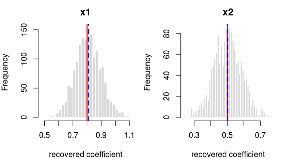
<figcaption aria-hidden="true">Recovered coefficients for y ~ x1 + x2
over 1600 datasets.</figcaption>
</figure>

*Each panel: the spread of one recovered coefficient across 1600
generated datasets. Red line = the true value, blue dashed = the average
estimate. File reproduces from seed: **yes**.*

## log-odds(y = 1) = logit(0.30) + 0.5·x1 + 0.4·g\[2\] + 0.8·g\[3\]

R formula `y ~ x1 + g` · logistic regression (R’s `glm`) · n = 1000 ·
saved as `data/glm_factor_a.rds`

**How it’s built:** one continuous predictor (`x1`) drawn from a
standard normal (mean 0, sd 1); a 3-level factor `g` at proportions
50%/30%/20%. The outcome is 1 or 0, drawn at the logistic probability of
the formula above (baseline rate 30%). Sample size 1000, random seed
2137.

**Data checks** — statistics of the generated data, averaged over all
draws, vs. what was requested:

| What we check         | Requested | Average over draws | Allowed difference | Result |
|:----------------------|----------:|-------------------:|:-------------------|:-------|
| average of x1         |       0.0 |             0.0014 | within 0.01        | OK     |
| std. deviation of x1  |       1.0 |             0.9996 | within 0.01        | OK     |
| proportion in level 0 |       0.5 |             0.5000 | within 0.01        | OK     |
| proportion in level 1 |       0.3 |             0.3000 | within 0.01        | OK     |
| proportion in level 2 |       0.2 |             0.2000 | within 0.01        | OK     |

**Coefficient recovery** — an independent R model fitted to each
generated dataset; the average estimate should land on the true value:

| Term | True value | Recovered (average) | Spread across draws | Std. errors from true | Result |
|:---|---:|---:|---:|---:|:---|
| intercept | -0.8473 | -0.8505 | 0.1012 | -1.2502 | OK |
| x1 | 0.5000 | 0.5045 | 0.0715 | 2.4953 | OK |
| g\[2\] | 0.4000 | 0.3937 | 0.1585 | -1.5868 | OK |
| g\[3\] | 0.8000 | 0.8032 | 0.1816 | 0.6986 | OK |

Every coefficient is centred on its true value — the formula holds in
the generated data.

<figure>
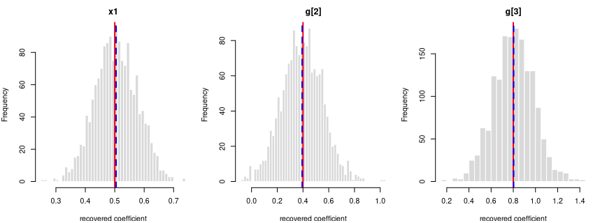
<figcaption aria-hidden="true">Recovered coefficients for y ~ x1 + g
over 1600 datasets.</figcaption>
</figure>

*Each panel: the spread of one recovered coefficient across 1600
generated datasets. Red line = the true value, blue dashed = the average
estimate. File reproduces from seed: **yes**.*

## log-odds(y = 1) = logit(0.50) + 0.8·x1 + 0.5·g\[2\] + 0.8·g\[3\]

R formula `y ~ x1 + g` · logistic regression (R’s `glm`) · n = 1000 ·
saved as `data/glm_factor_b.rds`

**How it’s built:** one continuous predictor (`x1`) drawn from a
standard normal (mean 0, sd 1); a 3-level factor `g` at proportions
40%/35%/25%. The outcome is 1 or 0, drawn at the logistic probability of
the formula above (baseline rate 50%). Sample size 1000, random seed
2138.

**Data checks** — statistics of the generated data, averaged over all
draws, vs. what was requested:

| What we check         | Requested | Average over draws | Allowed difference | Result |
|:----------------------|----------:|-------------------:|:-------------------|:-------|
| average of x1         |      0.00 |             0.0015 | within 0.01        | OK     |
| std. deviation of x1  |      1.00 |             0.9996 | within 0.01        | OK     |
| proportion in level 0 |      0.40 |             0.4000 | within 0.01        | OK     |
| proportion in level 1 |      0.35 |             0.3500 | within 0.01        | OK     |
| proportion in level 2 |      0.25 |             0.2500 | within 0.01        | OK     |

**Coefficient recovery** — an independent R model fitted to each
generated dataset; the average estimate should land on the true value:

| Term | True value | Recovered (average) | Spread across draws | Std. errors from true | Result |
|:---|---:|---:|---:|---:|:---|
| intercept | 0.0 | -0.0014 | 0.1077 | -0.5165 | OK |
| x1 | 0.8 | 0.8075 | 0.0792 | 3.7777 | OK |
| g\[2\] | 0.5 | 0.4983 | 0.1626 | -0.4064 | OK |
| g\[3\] | 0.8 | 0.8052 | 0.1771 | 1.1727 | OK |

Every coefficient is centred on its true value — the formula holds in
the generated data.

<figure>
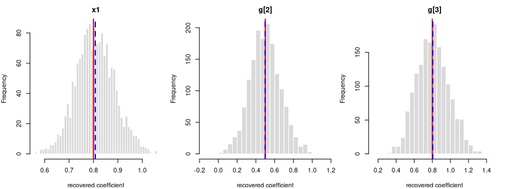
<figcaption aria-hidden="true">Recovered coefficients for y ~ x1 + g
over 1600 datasets.</figcaption>
</figure>

*Each panel: the spread of one recovered coefficient across 1600
generated datasets. Red line = the true value, blue dashed = the average
estimate. File reproduces from seed: **yes**.*

## log-odds(y = 1) = logit(0.30) + 0.5·x1 + 0.3·x2 + 0.3·x1:x2

R formula `y ~ x1*x2` · logistic regression (R’s `glm`) · n = 1000 ·
saved as `data/glm_interaction_a.rds`

**How it’s built:** 2 continuous predictors (`x1`, `x2`) drawn from a
standard normal (mean 0, sd 1). The outcome is 1 or 0, drawn at the
logistic probability of the formula above (baseline rate 30%). Sample
size 1000, random seed 2137.

**Data checks** — statistics of the generated data, averaged over all
draws, vs. what was requested:

| What we check        | Requested | Average over draws | Allowed difference | Result |
|:---------------------|----------:|-------------------:|:-------------------|:-------|
| average of x1        |         0 |             0.0014 | within 0.01        | OK     |
| std. deviation of x1 |         1 |             0.9996 | within 0.01        | OK     |
| average of x2        |         0 |             0.0007 | within 0.01        | OK     |
| std. deviation of x2 |         1 |             0.9993 | within 0.01        | OK     |

**Coefficient recovery** — an independent R model fitted to each
generated dataset; the average estimate should land on the true value:

| Term | True value | Recovered (average) | Spread across draws | Std. errors from true | Result |
|:---|---:|---:|---:|---:|:---|
| intercept | -0.8473 | -0.8532 | 0.0719 | -3.3004 | OK |
| x1 | 0.5000 | 0.5054 | 0.0767 | 2.8177 | OK |
| x2 | 0.3000 | 0.3033 | 0.0735 | 1.7887 | OK |
| x1:x2 | 0.3000 | 0.3008 | 0.0808 | 0.3714 | OK |

Every coefficient is centred on its true value — the formula holds in
the generated data.

<figure>
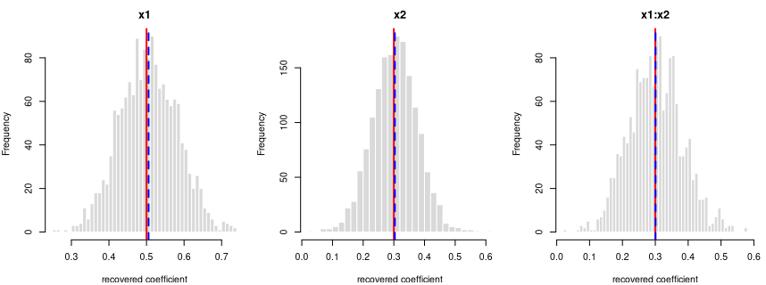
<figcaption aria-hidden="true">Recovered coefficients for y ~ x1*x2 over
1600 datasets.</figcaption>
</figure>

*Each panel: the spread of one recovered coefficient across 1600
generated datasets. Red line = the true value, blue dashed = the average
estimate. File reproduces from seed: **yes**.*

## log-odds(y = 1) = logit(0.50) + 0.8·x1 + 0.5·x2 + 0.4·x1:x2

R formula `y ~ x1*x2` · logistic regression (R’s `glm`) · n = 1000 ·
saved as `data/glm_interaction_b.rds`

**How it’s built:** 2 continuous predictors (`x1`, `x2`) drawn from a
standard normal (mean 0, sd 1). The outcome is 1 or 0, drawn at the
logistic probability of the formula above (baseline rate 50%). Sample
size 1000, random seed 2138.

**Data checks** — statistics of the generated data, averaged over all
draws, vs. what was requested:

| What we check        | Requested | Average over draws | Allowed difference | Result |
|:---------------------|----------:|-------------------:|:-------------------|:-------|
| average of x1        |         0 |             0.0015 | within 0.01        | OK     |
| std. deviation of x1 |         1 |             0.9996 | within 0.01        | OK     |
| average of x2        |         0 |             0.0007 | within 0.01        | OK     |
| std. deviation of x2 |         1 |             0.9993 | within 0.01        | OK     |

**Coefficient recovery** — an independent R model fitted to each
generated dataset; the average estimate should land on the true value:

| Term | True value | Recovered (average) | Spread across draws | Std. errors from true | Result |
|:---|---:|---:|---:|---:|:---|
| intercept | 0.0 | -0.0028 | 0.0702 | -1.6099 | OK |
| x1 | 0.8 | 0.8085 | 0.0819 | 4.1426 | OK |
| x2 | 0.5 | 0.5070 | 0.0761 | 3.6710 | OK |
| x1:x2 | 0.4 | 0.4021 | 0.0864 | 0.9811 | OK |

Every coefficient is centred on its true value — the formula holds in
the generated data.

<figure>
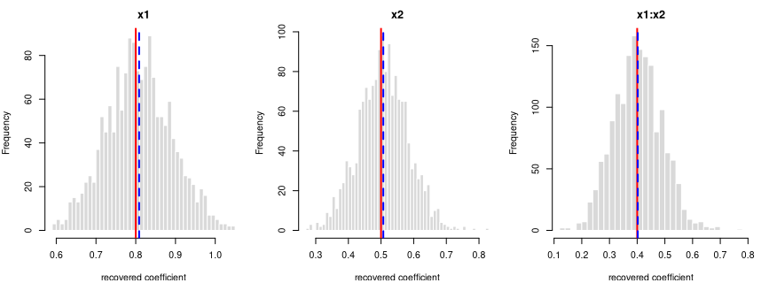
<figcaption aria-hidden="true">Recovered coefficients for y ~ x1*x2 over
1600 datasets.</figcaption>
</figure>

*Each panel: the spread of one recovered coefficient across 1600
generated datasets. Red line = the true value, blue dashed = the average
estimate. File reproduces from seed: **yes**.*

## y = 0.5·x1 + per-grp random intercept (ICC 0.20) + noise

R formula `y ~ x1 + (1|grp)` · linear mixed model (`lme4::lmer`) · n =
600 · saved as `data/lme_simple_a.rds`

**How it’s built:** one continuous predictor (`x1`) drawn from a
standard normal (mean 0, sd 1). The outcome is the formula above, plus a
shared offset for each of the 20 clusters (30 observations each, sized
to an intra-cluster correlation of 0.20), plus standard-normal noise.
Sample size 600, random seed 2137.

**Data checks** — statistics of the generated data, averaged over all
draws, vs. what was requested:

| What we check | Requested | Average over draws | Allowed difference | Result |
|:---|---:|---:|:---|:---|
| average of x1 | 0.0000 | 0.0007 | within 0.01 | OK |
| std. deviation of x1 | 1.0000 | 0.9993 | within 0.01 | OK |
| within-cluster variance | 1.0000 | 0.9990 | within 1% | OK |
| intra-cluster correlation (ICC) | 0.2000 | 0.1978 | within 0.01 | OK |
| observed (marginal) ICC vs predicted | 0.1659 | 0.1657 | within 0.01 | OK |

**Coefficient recovery** — an independent R model fitted to each
generated dataset; the average estimate should land on the true value:

| Term | True value | Recovered (average) | Spread across draws | Std. errors from true | Result |
|:---|---:|---:|---:|---:|:---|
| intercept | 0.0 | 0.0085 | 0.1168 | 2.0682 | OK |
| x1 | 0.5 | 0.4992 | 0.0420 | -0.5401 | OK |

Every coefficient is centred on its true value — the formula holds in
the generated data.

The intra-cluster correlation you set is the **conditional** ICC — the
correlation between two observations in the same cluster *after
accounting for the predictors* — and the generator recovers it (the
“intra-cluster correlation (ICC)” row above). The **observed (marginal)
ICC** of the raw outcome is lower, because the predictors explain part
of the total variance; the stronger the fixed effects, the larger the
gap. This is the standard conditional-vs-marginal distinction — expected
and correct, not a generation fault — and the “observed (marginal) ICC
vs predicted” row confirms the observed value lands on what that
distinction predicts.

<figure>
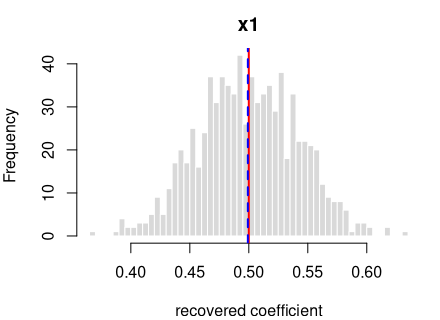
<figcaption aria-hidden="true">Recovered coefficients for y ~ x1 +
(1|grp) over 800 datasets.</figcaption>
</figure>

*Each panel: the spread of one recovered coefficient across 800
generated datasets. Red line = the true value, blue dashed = the average
estimate. File reproduces from seed: **yes**.*

## y = 0.3·x1 + per-grp random intercept (ICC 0.30) + noise

R formula `y ~ x1 + (1|grp)` · linear mixed model (`lme4::lmer`) · n =
600 · saved as `data/lme_simple_b.rds`

**How it’s built:** one continuous predictor (`x1`) drawn from a
standard normal (mean 0, sd 1). The outcome is the formula above, plus a
shared offset for each of the 20 clusters (30 observations each, sized
to an intra-cluster correlation of 0.30), plus standard-normal noise.
Sample size 600, random seed 2138.

**Data checks** — statistics of the generated data, averaged over all
draws, vs. what was requested:

| What we check | Requested | Average over draws | Allowed difference | Result |
|:---|---:|---:|:---|:---|
| average of x1 | 0.0000 | 0.0008 | within 0.01 | OK |
| std. deviation of x1 | 1.0000 | 0.9993 | within 0.01 | OK |
| within-cluster variance | 1.0000 | 0.9989 | within 1% | OK |
| intra-cluster correlation (ICC) | 0.3000 | 0.2948 | within 0.01 | OK |
| observed (marginal) ICC vs predicted | 0.2778 | 0.2779 | within 0.01 | OK |

**Coefficient recovery** — an independent R model fitted to each
generated dataset; the average estimate should land on the true value:

| Term | True value | Recovered (average) | Spread across draws | Std. errors from true | Result |
|:---|---:|---:|---:|---:|:---|
| intercept | 0.0 | 0.0098 | 0.1491 | 1.8547 | OK |
| x1 | 0.3 | 0.2991 | 0.0421 | -0.5956 | OK |

Every coefficient is centred on its true value — the formula holds in
the generated data.

The intra-cluster correlation you set is the **conditional** ICC — the
correlation between two observations in the same cluster *after
accounting for the predictors* — and the generator recovers it (the
“intra-cluster correlation (ICC)” row above). The **observed (marginal)
ICC** of the raw outcome is lower, because the predictors explain part
of the total variance; the stronger the fixed effects, the larger the
gap. This is the standard conditional-vs-marginal distinction — expected
and correct, not a generation fault — and the “observed (marginal) ICC
vs predicted” row confirms the observed value lands on what that
distinction predicts.

<figure>

<figcaption aria-hidden="true">Recovered coefficients for y ~ x1 +
(1|grp) over 800 datasets.</figcaption>
</figure>

*Each panel: the spread of one recovered coefficient across 800
generated datasets. Red line = the true value, blue dashed = the average
estimate. File reproduces from seed: **yes**.*

## y = 0.5·x1 + 0.3·x2 + per-grp random intercept (ICC 0.20) + noise

R formula `y ~ x1 + x2 + (1|grp)` · linear mixed model (`lme4::lmer`) ·
n = 750 · saved as `data/lme_two_a.rds`

**How it’s built:** 2 continuous predictors (`x1`, `x2`) drawn from a
standard normal (mean 0, sd 1). The outcome is the formula above, plus a
shared offset for each of the 25 clusters (30 observations each, sized
to an intra-cluster correlation of 0.20), plus standard-normal noise.
Sample size 750, random seed 2137.

**Data checks** — statistics of the generated data, averaged over all
draws, vs. what was requested:

| What we check | Requested | Average over draws | Allowed difference | Result |
|:---|---:|---:|:---|:---|
| average of x1 | 0.0000 | 0.0012 | within 0.01 | OK |
| std. deviation of x1 | 1.0000 | 0.9994 | within 0.01 | OK |
| average of x2 | 0.0000 | -0.0002 | within 0.01 | OK |
| std. deviation of x2 | 1.0000 | 0.9986 | within 0.01 | OK |
| within-cluster variance | 1.0000 | 0.9988 | within 1% | OK |
| intra-cluster correlation (ICC) | 0.2000 | 0.1978 | within 0.01 | OK |
| observed (marginal) ICC vs predicted | 0.1566 | 0.1549 | within 0.01 | OK |

**Coefficient recovery** — an independent R model fitted to each
generated dataset; the average estimate should land on the true value:

| Term | True value | Recovered (average) | Spread across draws | Std. errors from true | Result |
|:---|---:|---:|---:|---:|:---|
| intercept | 0.0 | 0.0074 | 0.1073 | 1.9570 | OK |
| x1 | 0.5 | 0.4994 | 0.0380 | -0.4171 | OK |
| x2 | 0.3 | 0.3008 | 0.0372 | 0.6220 | OK |

Every coefficient is centred on its true value — the formula holds in
the generated data.

The intra-cluster correlation you set is the **conditional** ICC — the
correlation between two observations in the same cluster *after
accounting for the predictors* — and the generator recovers it (the
“intra-cluster correlation (ICC)” row above). The **observed (marginal)
ICC** of the raw outcome is lower, because the predictors explain part
of the total variance; the stronger the fixed effects, the larger the
gap. This is the standard conditional-vs-marginal distinction — expected
and correct, not a generation fault — and the “observed (marginal) ICC
vs predicted” row confirms the observed value lands on what that
distinction predicts.

<figure>
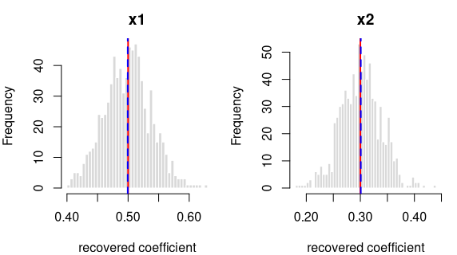
<figcaption aria-hidden="true">Recovered coefficients for y ~ x1 + x2 +
(1|grp) over 800 datasets.</figcaption>
</figure>

*Each panel: the spread of one recovered coefficient across 800
generated datasets. Red line = the true value, blue dashed = the average
estimate. File reproduces from seed: **yes**.*

## y = 0.3·x1 + 0.5·x2 + per-grp random intercept (ICC 0.30) + noise

R formula `y ~ x1 + x2 + (1|grp)` · linear mixed model (`lme4::lmer`) ·
n = 750 · saved as `data/lme_two_b.rds`

**How it’s built:** 2 continuous predictors (`x1`, `x2`) drawn from a
standard normal (mean 0, sd 1). The outcome is the formula above, plus a
shared offset for each of the 25 clusters (30 observations each, sized
to an intra-cluster correlation of 0.30), plus standard-normal noise.
Sample size 750, random seed 2138.

**Data checks** — statistics of the generated data, averaged over all
draws, vs. what was requested:

| What we check | Requested | Average over draws | Allowed difference | Result |
|:---|---:|---:|:---|:---|
| average of x1 | 0.0000 | 0.0012 | within 0.01 | OK |
| std. deviation of x1 | 1.0000 | 0.9994 | within 0.01 | OK |
| average of x2 | 0.0000 | -0.0001 | within 0.01 | OK |
| std. deviation of x2 | 1.0000 | 0.9986 | within 0.01 | OK |
| within-cluster variance | 1.0000 | 0.9988 | within 1% | OK |
| intra-cluster correlation (ICC) | 0.3000 | 0.2950 | within 0.01 | OK |
| observed (marginal) ICC vs predicted | 0.2395 | 0.2377 | within 0.01 | OK |

**Coefficient recovery** — an independent R model fitted to each
generated dataset; the average estimate should land on the true value:

| Term | True value | Recovered (average) | Spread across draws | Std. errors from true | Result |
|:---|---:|---:|---:|---:|:---|
| intercept | 0.0 | 0.0088 | 0.1371 | 1.8113 | OK |
| x1 | 0.3 | 0.2994 | 0.0380 | -0.4832 | OK |
| x2 | 0.5 | 0.5009 | 0.0373 | 0.7116 | OK |

Every coefficient is centred on its true value — the formula holds in
the generated data.

The intra-cluster correlation you set is the **conditional** ICC — the
correlation between two observations in the same cluster *after
accounting for the predictors* — and the generator recovers it (the
“intra-cluster correlation (ICC)” row above). The **observed (marginal)
ICC** of the raw outcome is lower, because the predictors explain part
of the total variance; the stronger the fixed effects, the larger the
gap. This is the standard conditional-vs-marginal distinction — expected
and correct, not a generation fault — and the “observed (marginal) ICC
vs predicted” row confirms the observed value lands on what that
distinction predicts.

<figure>
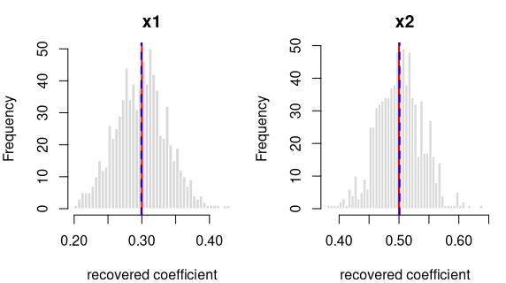
<figcaption aria-hidden="true">Recovered coefficients for y ~ x1 + x2 +
(1|grp) over 800 datasets.</figcaption>
</figure>

*Each panel: the spread of one recovered coefficient across 800
generated datasets. Red line = the true value, blue dashed = the average
estimate. File reproduces from seed: **yes**.*

## y = 0.5·x1 + 0.3·x2 + 0.3·x1:x2 + per-grp random intercept (ICC 0.20) + noise

R formula `y ~ x1*x2 + (1|grp)` · linear mixed model (`lme4::lmer`) · n
= 750 · saved as `data/lme_interaction_a.rds`

**How it’s built:** 2 continuous predictors (`x1`, `x2`) drawn from a
standard normal (mean 0, sd 1). The outcome is the formula above, plus a
shared offset for each of the 25 clusters (30 observations each, sized
to an intra-cluster correlation of 0.20), plus standard-normal noise.
Sample size 750, random seed 2137.

**Data checks** — statistics of the generated data, averaged over all
draws, vs. what was requested:

| What we check | Requested | Average over draws | Allowed difference | Result |
|:---|---:|---:|:---|:---|
| average of x1 | 0.0000 | 0.0012 | within 0.01 | OK |
| std. deviation of x1 | 1.0000 | 0.9994 | within 0.01 | OK |
| average of x2 | 0.0000 | -0.0002 | within 0.01 | OK |
| std. deviation of x2 | 1.0000 | 0.9986 | within 0.01 | OK |
| within-cluster variance | 1.0000 | 0.9988 | within 1% | OK |
| intra-cluster correlation (ICC) | 0.2000 | 0.1978 | within 0.01 | OK |
| observed (marginal) ICC vs predicted | 0.1485 | 0.1464 | within 0.01 | OK |

**Coefficient recovery** — an independent R model fitted to each
generated dataset; the average estimate should land on the true value:

| Term | True value | Recovered (average) | Spread across draws | Std. errors from true | Result |
|:---|---:|---:|---:|---:|:---|
| intercept | 0.0 | 0.0075 | 0.1073 | 1.9725 | OK |
| x1 | 0.5 | 0.4994 | 0.0380 | -0.4690 | OK |
| x2 | 0.3 | 0.3008 | 0.0372 | 0.6211 | OK |
| x1:x2 | 0.3 | 0.3023 | 0.0363 | 1.8252 | OK |

Every coefficient is centred on its true value — the formula holds in
the generated data.

The intra-cluster correlation you set is the **conditional** ICC — the
correlation between two observations in the same cluster *after
accounting for the predictors* — and the generator recovers it (the
“intra-cluster correlation (ICC)” row above). The **observed (marginal)
ICC** of the raw outcome is lower, because the predictors explain part
of the total variance; the stronger the fixed effects, the larger the
gap. This is the standard conditional-vs-marginal distinction — expected
and correct, not a generation fault — and the “observed (marginal) ICC
vs predicted” row confirms the observed value lands on what that
distinction predicts.

<figure>
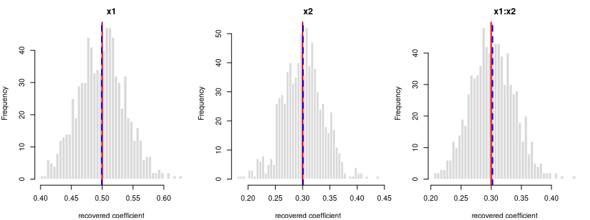
<figcaption aria-hidden="true">Recovered coefficients for y ~ x1*x2 +
(1|grp) over 800 datasets.</figcaption>
</figure>

*Each panel: the spread of one recovered coefficient across 800
generated datasets. Red line = the true value, blue dashed = the average
estimate. File reproduces from seed: **yes**.*

## y = 0.4·x1 + 0.3·x2 + 0.2·x1:x2 + per-grp random intercept (ICC 0.30) + noise

R formula `y ~ x1*x2 + (1|grp)` · linear mixed model (`lme4::lmer`) · n
= 900 · saved as `data/lme_interaction_b.rds`

**How it’s built:** 2 continuous predictors (`x1`, `x2`) drawn from a
standard normal (mean 0, sd 1). The outcome is the formula above, plus a
shared offset for each of the 30 clusters (30 observations each, sized
to an intra-cluster correlation of 0.30), plus standard-normal noise.
Sample size 900, random seed 2138.

**Data checks** — statistics of the generated data, averaged over all
draws, vs. what was requested:

| What we check | Requested | Average over draws | Allowed difference | Result |
|:---|---:|---:|:---|:---|
| average of x1 | 0.0000 | 0.0017 | within 0.01 | OK |
| std. deviation of x1 | 1.0000 | 0.9995 | within 0.01 | OK |
| average of x2 | 0.0000 | 0.0002 | within 0.01 | OK |
| std. deviation of x2 | 1.0000 | 0.9989 | within 0.01 | OK |
| within-cluster variance | 1.0000 | 1.0000 | within 1% | OK |
| intra-cluster correlation (ICC) | 0.3000 | 0.2958 | within 0.01 | OK |
| observed (marginal) ICC vs predicted | 0.2469 | 0.2462 | within 0.01 | OK |

**Coefficient recovery** — an independent R model fitted to each
generated dataset; the average estimate should land on the true value:

| Term | True value | Recovered (average) | Spread across draws | Std. errors from true | Result |
|:---|---:|---:|---:|---:|:---|
| intercept | 0.0 | 0.0066 | 0.1240 | 1.4946 | OK |
| x1 | 0.4 | 0.3997 | 0.0345 | -0.2222 | OK |
| x2 | 0.3 | 0.3004 | 0.0344 | 0.3046 | OK |
| x1:x2 | 0.2 | 0.2025 | 0.0328 | 2.1481 | OK |

Every coefficient is centred on its true value — the formula holds in
the generated data.

The intra-cluster correlation you set is the **conditional** ICC — the
correlation between two observations in the same cluster *after
accounting for the predictors* — and the generator recovers it (the
“intra-cluster correlation (ICC)” row above). The **observed (marginal)
ICC** of the raw outcome is lower, because the predictors explain part
of the total variance; the stronger the fixed effects, the larger the
gap. This is the standard conditional-vs-marginal distinction — expected
and correct, not a generation fault — and the “observed (marginal) ICC
vs predicted” row confirms the observed value lands on what that
distinction predicts.

<figure>
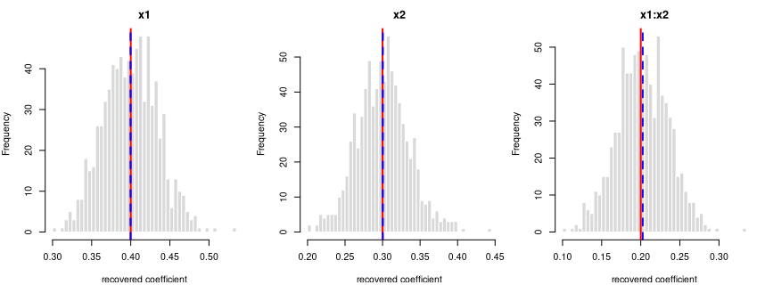
<figcaption aria-hidden="true">Recovered coefficients for y ~ x1*x2 +
(1|grp) over 800 datasets.</figcaption>
</figure>

*Each panel: the spread of one recovered coefficient across 800
generated datasets. Red line = the true value, blue dashed = the average
estimate. File reproduces from seed: **yes**.*

## y = 0.3·x1 + 0.3·g\[2\] + per-grp random intercept (ICC 0.20) + noise

R formula `y ~ x1 + g + (1|grp)` · linear mixed model (`lme4::lmer`) · n
= 750 · saved as `data/lme_factor_a.rds`

**How it’s built:** one continuous predictor (`x1`) drawn from a
standard normal (mean 0, sd 1); a 2-level factor `g` at proportions
50%/50%. The outcome is the formula above, plus a shared offset for each
of the 25 clusters (30 observations each, sized to an intra-cluster
correlation of 0.20), plus standard-normal noise. Sample size 750,
random seed 2137.

**Data checks** — statistics of the generated data, averaged over all
draws, vs. what was requested:

| What we check | Requested | Average over draws | Allowed difference | Result |
|:---|---:|---:|:---|:---|
| average of x1 | 0.0000 | 0.0012 | within 0.01 | OK |
| std. deviation of x1 | 1.0000 | 0.9994 | within 0.01 | OK |
| proportion in level 0 | 0.5000 | 0.5000 | within 0.01 | OK |
| proportion in level 1 | 0.5000 | 0.5000 | within 0.01 | OK |
| within-cluster variance | 1.0000 | 0.9988 | within 1% | OK |
| intra-cluster correlation (ICC) | 0.2000 | 0.1978 | within 0.01 | OK |
| observed (marginal) ICC vs predicted | 0.1815 | 0.1806 | within 0.01 | OK |

**Coefficient recovery** — an independent R model fitted to each
generated dataset; the average estimate should land on the true value:

| Term | True value | Recovered (average) | Spread across draws | Std. errors from true | Result |
|:---|---:|---:|---:|---:|:---|
| intercept | 0.0 | 0.0058 | 0.1142 | 1.4317 | OK |
| x1 | 0.3 | 0.2994 | 0.0380 | -0.4305 | OK |
| g\[2\] | 0.3 | 0.3033 | 0.0732 | 1.2911 | OK |

Every coefficient is centred on its true value — the formula holds in
the generated data.

The intra-cluster correlation you set is the **conditional** ICC — the
correlation between two observations in the same cluster *after
accounting for the predictors* — and the generator recovers it (the
“intra-cluster correlation (ICC)” row above). The **observed (marginal)
ICC** of the raw outcome is lower, because the predictors explain part
of the total variance; the stronger the fixed effects, the larger the
gap. This is the standard conditional-vs-marginal distinction — expected
and correct, not a generation fault — and the “observed (marginal) ICC
vs predicted” row confirms the observed value lands on what that
distinction predicts.

<figure>
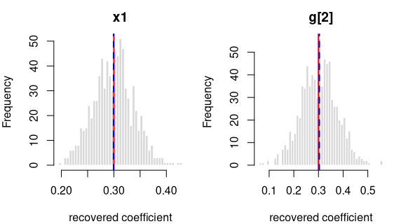
<figcaption aria-hidden="true">Recovered coefficients for y ~ x1 + g +
(1|grp) over 800 datasets.</figcaption>
</figure>

*Each panel: the spread of one recovered coefficient across 800
generated datasets. Red line = the true value, blue dashed = the average
estimate. File reproduces from seed: **yes**.*

## y = 0.4·x1 + 0.5·g\[2\] + 0.8·g\[3\] + per-grp random intercept (ICC 0.30) + noise

R formula `y ~ x1 + g + (1|grp)` · linear mixed model (`lme4::lmer`) · n
= 900 · saved as `data/lme_factor_b.rds`

**How it’s built:** one continuous predictor (`x1`) drawn from a
standard normal (mean 0, sd 1); a 3-level factor `g` at proportions
50%/30%/20%. The outcome is the formula above, plus a shared offset for
each of the 30 clusters (30 observations each, sized to an intra-cluster
correlation of 0.30), plus standard-normal noise. Sample size 900,
random seed 2138.

**Data checks** — statistics of the generated data, averaged over all
draws, vs. what was requested:

| What we check | Requested | Average over draws | Allowed difference | Result |
|:---|---:|---:|:---|:---|
| average of x1 | 0.0000 | 0.0017 | within 0.01 | OK |
| std. deviation of x1 | 1.0000 | 0.9995 | within 0.01 | OK |
| proportion in level 0 | 0.5000 | 0.5000 | within 0.01 | OK |
| proportion in level 1 | 0.3000 | 0.3000 | within 0.01 | OK |
| proportion in level 2 | 0.2000 | 0.2000 | within 0.01 | OK |
| within-cluster variance | 1.0000 | 1.0000 | within 1% | OK |
| intra-cluster correlation (ICC) | 0.3000 | 0.2958 | within 0.01 | OK |
| observed (marginal) ICC vs predicted | 0.3145 | 0.3136 | within 0.01 | OK |

**Coefficient recovery** — an independent R model fitted to each
generated dataset; the average estimate should land on the true value:

| Term | True value | Recovered (average) | Spread across draws | Std. errors from true | Result |
|:---|---:|---:|---:|---:|:---|
| intercept | 0.0 | 0.0063 | 0.1779 | 1.0072 | OK |
| x1 | 0.4 | 0.3998 | 0.0345 | -0.1763 | OK |
| g\[2\] | 0.5 | 0.4928 | 0.2888 | -0.7017 | OK |
| g\[3\] | 0.8 | 0.8117 | 0.3162 | 1.0496 | OK |

Every coefficient is centred on its true value — the formula holds in
the generated data.

The intra-cluster correlation you set is the **conditional** ICC — the
correlation between two observations in the same cluster *after
accounting for the predictors* — and the generator recovers it (the
“intra-cluster correlation (ICC)” row above). The **observed (marginal)
ICC** of the raw outcome is lower, because the predictors explain part
of the total variance; the stronger the fixed effects, the larger the
gap. This is the standard conditional-vs-marginal distinction — expected
and correct, not a generation fault — and the “observed (marginal) ICC
vs predicted” row confirms the observed value lands on what that
distinction predicts.

<figure>
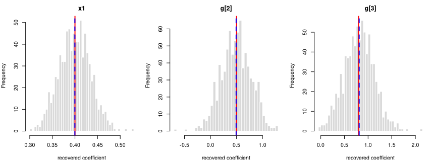
<figcaption aria-hidden="true">Recovered coefficients for y ~ x1 + g +
(1|grp) over 800 datasets.</figcaption>
</figure>

*Each panel: the spread of one recovered coefficient across 800
generated datasets. Red line = the true value, blue dashed = the average
estimate. File reproduces from seed: **yes**.*

# How this was produced

| item | value |
|:---|:---|
| Report generated | 21 June 2026 |
| R version | R version 4.5.3 (2026-03-11) |
| mcpower | 1.0.0 |
| lme4 | 1.1.38 |
| Draws per formula (ordinary / logistic) | 1,600 |
| Draws per formula (mixed) | 800 |
| Recovery threshold | OLS/LME: pooled BH-FDR ≤ 0.001 (Benjamini-Hochberg); logit: \|mean−true\| ≤ 0.02 (absolute) |
| Formulas validated | 31 |

The datasets are generated by `mcpower/validation/data_generation.r`
from the formula catalogue in `mcpower/validation/formulas.R`; this
report regenerates them many times over and runs the checks above. To
reproduce it, from the repository root:

``` r
rmarkdown::render("mcpower/validation/validation_data_generation.rmd",
                  output_dir = "mcpower/web/documentation/validation")
```
